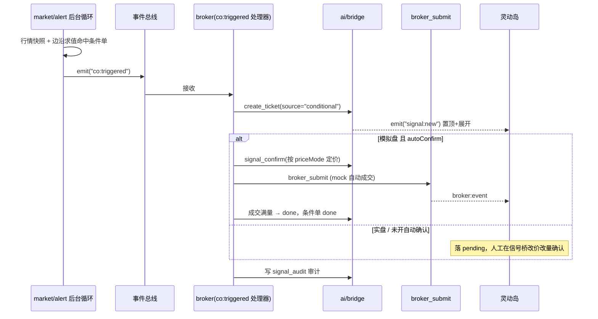
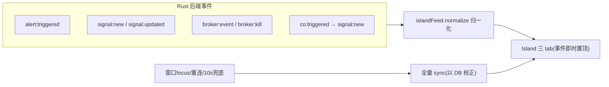

# TickGold・v2.23.0 高阶盯盘・技术设计与开发任务书

> **基线：**
>
>  v2.21.0　
>
> **目标版本：**
>
>  v2.23.0
> **范围（四大模块）：**
>
>  ① 本地条件单引擎　② 灵动岛事件驱动同步　③ 多股同列增强　④ 盯盘模板
> **总原则：**
>
>  不重复造轮子 —— 全部能力以「扩展字段 / 复用循环 / 新增卡片 / 插件化」方式长在现有框架上。
> **工作量：**
>
>  约 11 PD（单人 + AI 辅助），建议 2 周（含一次真实盘中联调）。
> **更新日期：**
>
>  2026-10-10


***

## 一、可复用资产盘点（本版依赖，禁止重造）


| 能力                                        | 现有实现                                                                                                              | 本版如何复用                                         |
| ----------------------------------------- | ----------------------------------------------------------------------------------------------------------------- | ---------------------------------------------- |
| 后台行情定时批量拉取 + 边沿 / 阈值 / 封板 / 炸板判定 + 冷却     | `src-tauri/src/market/alert.rs`：`AlertRule`/`AlertEvent`/`AlertEngine`/`run_loop`                                 | 条件单触发检测挂到同一检测周期，复用字段求值、边沿状态、冷却                 |
| 信号确认桥落单 / 状态机                             | `src-tauri/src/ai/bridge.rs`：`create_ticket`/`create_manual`、`signal_confirm`/`reject`/`list`                     | 条件单命中后生成 `signal_ticket`（source=`conditional`） |
| 委托执行 + 风控 + 状态机 + 审计                      | `src-tauri/src/broker/mod.rs`（`broker_submit`/`broker_cancel`/kill\_switch）、`broker/risk.rs`、`broker/protocol.rs` | 条件单触发后统一走 `broker_submit`（mock 自动 / QMT 人工）    |
| 自动执行循环（行情快照 / 持仓 / 风控 / 买卖 /bridge\_push） | `src-tauri/src/ai/autoexec.rs`：`run_loop`、`check_risk_controls`、`bridge_push`                                     | 条件单检测的编排参考；执行路径统一收口到 broker，避免再分叉              |
| 前端条件树判定纯函数                                | `src/alert/evaluate.ts`、`gates.ts`、`fields.ts`                                                                    | 条件单 UI 的条件编辑 / 校验复用 Leaf/Op 语义                 |
| 卡片 / 场景 / 布局                              | `src/lib/scenes.ts`（MODES/TIME\_PRESETS/SCENES）、`src/lib/cards.ts`、`useWorkbench.ts`                              | 新卡片注册；盯盘模板在 SCENES 上扩展                         |
| 灵动岛                                       | `src/components/Island.vue`（已监听多类事件 + 15s 兜底）                                                                     | 事件归一、预警回补、委托角标修正                               |
| 多股同列                                      | `src/components/MultiStockGrid.vue`、`MultiCell.vue`                                                               | 布局 / 数据源 / 实时刷新 / 联动增强                         |


***

## 二、模块一：本地条件单引擎（核心，约 4.5 PD）

### 2.1 定位与边界


* **条件单 = 用户预设、带触发条件的买卖意图。** 与预警的区别：预警命中只通知；条件单命中**产生委托**。

* **决策权分层不变：** 模拟账户可「自动确认 + 自动提交」；实盘**一律落 pending 人工确认**，不自动真实下单。

* 条件单在 **Rust 后台**检测（不依赖 WebView 是否在前台），托盘驻留、窗口隐藏均可触发。

### 2.2 数据模型（新增迁移 **v47**，只追加，不改历史迁移）


```
CREATE TABLE IF NOT EXISTS conditional_order (
  id INTEGER PRIMARY KEY AUTOINCREMENT,
  co_id   TEXT NOT NULL UNIQUE,          -- 条件单业务ID（CO_ 前缀）
  trade_date TEXT DEFAULT '',
  code    TEXT NOT NULL,
  name    TEXT DEFAULT '',
  side    TEXT NOT NULL,                -- BUY / SELL
  trigger_json TEXT NOT NULL,           -- 触发条件数组(AND)，对齐 alert 字段/算子：
                                        -- [{field, op, value, params}]
  price_mode TEXT DEFAULT 'trigger',    -- trigger=触发价 / limit=指定限价 / market=涨跌停参考价
  limit_price REAL DEFAULT 0,
  vol     INTEGER NOT NULL,
  ttl     TEXT DEFAULT 'day',           -- day=当日有效 / gtc=撤销前有效 / date=指定截止
  expire_at INTEGER DEFAULT 0,
  auto_confirm INTEGER DEFAULT 0,       -- 模拟盘是否自动确认并提交
  status  TEXT DEFAULT 'active',        -- active/triggered/expired/cancelled/done/error
  ticket_id TEXT DEFAULT '',            -- 触发后生成的 signal sig_id
  note    TEXT DEFAULT '',
  created_at INTEGER NOT NULL,
  updated_at INTEGER DEFAULT 0,
  triggered_at INTEGER DEFAULT 0
);
CREATE INDEX IF NOT EXISTS idx_co_status ON conditional_order(status);
CREATE INDEX IF NOT EXISTS idx_co_code   ON conditional_order(code);
```

> `trigger_json`
>
>  的 
>
> `field/op`
>
>  直接复用 
>
> `market/alert.rs`
>
>  已支持的字段（price、pct、volume、量比、涨速、封板、炸板、换手、成交额）与算子（
>
> `>= <= > < crossUp crossDown`
>
> ），
>
> **不新增判定引擎**
>
> 。

### 2.3 Rust 端设计

**新增文件&#x20;**`src-tauri/src/broker/conditional.rs`**，并在&#x20;**`broker/mod.rs`**&#x20;注册&#x20;**`pub mod conditional;`


```
// 触发条件叶子（与 alert.rs / 前端 Leaf 同构）
#[derive(Serialize, Deserialize, Clone)]
#[serde(rename_all = "camelCase")]
pub struct CoTrigger { pub field: String, pub op: String,
    pub value: f64, pub params: Option<serde_json::Value> }

#[derive(Serialize, Deserialize, Clone)]
#[serde(rename_all = "camelCase")]
pub struct ConditionalOrder {
    pub id: i64, pub co_id: String, pub trade_date: String,
    pub code: String, pub name: String, pub side: String,
    pub trigger: Vec<CoTrigger>,
    pub price_mode: String, pub limit_price: f64, pub vol: i64,
    pub ttl: String, pub expire_at: i64, pub auto_confirm: bool,
    pub status: String, pub ticket_id: String, pub note: String,
    pub created_at: i64, pub updated_at: i64, pub triggered_at: i64,
}
```

**Tauri 命令（新增，全部在 broker 域）：**


| 命令              | 入参                                                                                              | 返回                      | 说明                     |
| --------------- | ----------------------------------------------------------------------------------------------- | ----------------------- | ---------------------- |
| `co_list`       | `status?: String`                                                                               | `Vec<ConditionalOrder>` | 列表（默认 active + 当日已触发）  |
| `co_create`     | `code,name,side,trigger: Vec<CoTrigger>,priceMode,limitPrice,vol,ttl,expireAt,autoConfirm,note` | `String(co_id)`         | 建单，校验数量 100 整数倍、卖出需有持仓 |
| `co_update`     | `id, vol?, limitPrice?, ttl?, expireAt?, autoConfirm?, enabled?`                                | `()`                    | 仅 active 可改            |
| `co_cancel`     | `id`                                                                                            | `()`                    | 撤销（写审计）                |
| `co_cancel_all` | —                                                                                               | `i64`（撤销数）              | 一键撤销全部 active          |

**触发检测（复用 alert 循环，不新增独立 loop）：**


1. 在 `market/alert.rs::run_loop` 每个检测周期拉到批量行情后，新增一步：读取 `active` 条件单，复用本周期的行情快照与**边沿状态**逐条求值（trigger 数组为 AND）。

2. 命中且通过冷却（每单默认边沿一次）后，将该单置 `triggered`，并 **emit&#x20;**`co:triggered`（payload：`coId/code/side/triggerPrice/vol/priceMode/autoConfirm`）。

3. 在 `lib.rs` setup 注册一个 broker 侧监听器，监听 `co:triggered` 统一执行交易动作（见 2.4）。

> 解耦理由：
>
> `market`
>
> （判定）不直接依赖 
>
> `ai/bridge`
>
>  落单，通过事件交给 
>
> `broker`
>
>  处理，避免模块循环依赖。

### 2.4 命中后交易链路（复用确认桥 + broker\_submit）




**委托价定价规则（price\_mode）：**


* `trigger`：以触发时实时价作为委托价；

* `limit`：用 `limit_price`；

* `market`：买入按涨停价、卖出按跌停价（A 股 "市价" 兜底口径），UI 明示。

### 2.5 前端设计


* **新增卡片&#x20;**`src/components/ConditionalOrders.vue`：三段视图（进行中 / 已触发 / 已结束）、新建 / 编辑弹窗（复用 `AlertRuleDialog` 的字段选择器与算子）、触发历史、一键撤销；在 `cards.ts` 加 `CardId "co"`，`CardContent.vue` 加分支，菜单 / 命令面板（Ctrl+K）可搜。

* **新增&#x20;**`src/broker/co.api.ts`：封装上述命令 + TS 类型（与 Rust DTO 对齐）。

* 卡片与持仓 / 自选联动：卖出条件单显示可卖数量；触发后可直接跳转信号桥。

### 2.6 验收标准


* [ ] 条件单 CRUD 完整、重启后仍在；当日单收盘后自动 `expired`，GTC/date 单按 ttl 处理；

* [ ] 模拟盘：止盈 / 止损 / 突破单在真实（或回放）行情下完成「触发→自动确认→成交→done→审计」；

* [ ] 实盘：触发只落 pending，不自动下单；

* [ ] 边沿类条件首轮不触发、不重复触发；kill\_switch 触发时禁止条件单新动作；

* [ ] 单测：触发求值、定价、ttl 过期、状态机；E2E：建单→触发→看到信号。


***

## 三、模块二：灵动岛事件驱动同步（约 2 PD）

### 3.1 现状问题


1. 事件名多套并存（`alert:triggered` / `signal:new` / `signal:updated` / `broker:event` / `broker:kill`），岛上分散监听；

2. **预警 tab 只靠运行期事件累积，不回补历史**（重启后预警记录丢失；信号有 `syncSignals`，预警没有）；

3. 委托 tab 角标只取 `recentOrders.length`，未含实盘 `activeOrders`；`syncOrders` 每次都 `paper.load()`，重复加载；

4. 断线 / 窗口重新可见后无统一全量校正。

### 3.2 改造方案

**新增&#x20;**`src/alert/islandFeed.ts`**（统一归一化 + 订阅）：**


```
// 岛上统一条目（三 tab 通用）
export interface IslandItem {
  key: string; kind: "alert" | "signal" | "order";
  code: string; name: string;
  tone: "up" | "down" | "flat";
  title: string; detail: string;
  price: number; time: number; raw?: unknown;
}
// 把后端各类 payload 归一化
export function normalize(channel: string, p: unknown): IslandItem | null
// 一次性订阅所有通道，返回 unlisten 集合
export function subscribeIsland(onItem: (i: IslandItem) => void): Promise<() => void>
```


* `Island.vue` 改为只消费 `subscribeIsland`，删除分散 `listen`；事件即时置顶，状态以 DB 校正。

* **预警回补：** 新增 `syncAlerts()`，从预警触发历史（复用 alertV2 已持久化事件 / 或读取触发记录表）拉最近 20 条，与事件累积去重；与 `syncSignals` 同构。

* **委托口径修正：** `syncOrders` 只做一次加载（缓存 paper，避免重复 `paper.load`）；角标 = 模拟最近委托 + 实盘活跃委托合并计数。

* **生命周期校正：** 监听窗口 `focus` / 数据源重连 / Tauri 重连事件，触发三 tab 全量 `syncAlerts + syncSignals + syncOrders`；保留定时兜底（统一 10s）。

### 3.3 事件流




### 3.4 验收


* [ ] 任一后端事件 ≤1s 出现在对应 tab，角标正确（委托含实盘）；

* [ ] 重启 / 断线恢复后，预警、信号、委托三 tab 均能从 DB 回补、状态一致；

* [ ] 无重复加载、无重复条目；单测覆盖 `normalize` 各通道。


***

## 四、模块三：多股同列增强（约 2.5 PD）

### 4.1 现状问题

固定 3×3、只取自选前 9 只；迷你分时 / K 线**盘中不滚动刷新**（仅头部价实时）；各格独立请求、无并发治理；无同步十字光标；五档仅显示 3 档。

### 4.2 增强方案


| # | 增强点                                                                  | 实现                                                     |
| - | -------------------------------------------------------------------- | ------------------------------------------------------ |
| 1 | **布局可选**：2×2 / 3×3，数量可配                                              | `MultiStockGrid` 增加布局切换，grid-template 动态               |
| 2 | **股票来源可选**：自选分组 / 手动勾选 / 信号 & 条件单相关 / 临时输入                           | 抽出 `source` prop，复用 watchlist 分组与信号列表                  |
| 3 | **迷你图实时刷新**：可见格分时定时增量更新（默认 15s，节流，仅刷新可见格）                            | `MultiCell` 增加定时 `fetchMinute` 增量 + 缓存；切后台暂停           |
| 4 | **批量与并发治理**：头部价走 quotes store 批量；分时 / 盘口懒加载 + 缓存 + 复用并发闸门，避免 9 格并发风暴 | 复用 `fetchQuotes` 批量与 market 容灾；请求去重（同 code 共享 promise） |
| 5 | **同步十字光标（联动模式）**：聚焦大图时多格时间轴联动，或单格放大后显示完整十字                           | 复用 ECharts axisPointer connect；提供 "联动" 开关              |
| 6 | **格子信息增强**：叠加涨速 / 量比 / 封单（v2.25 数据，本版先占位字段）                          | 头部行预留指标位，数据缺失不报错                                       |
| 7 | 五档显示完整 5 档（普通态可折叠，放大态全显示）                                            | 调整 slice，复用 `get_orderbook`                            |

### 4.3 验收


* [ ] 2×2 / 3×3 切换正常，可按分组 / 手动 / 信号来源装载；

* [ ] 迷你分时盘中按节流实时滚动，切后台不耗请求；

* [ ] 多格请求无并发风暴（同 code 共享、走闸门）；联动十字可用；

* [ ] E2E：打开多股同列→切布局 / 来源→确认实时刷新；性能不低于 fps 基线。


***

## 五、模块四：盯盘模板（约 2 PD）

### 5.1 定位

把 "卡片集 + 布局 + 默认预警 + 默认条件单 + 自选分组" 打包为一键应用的打法模板，覆盖打板 / 低吸 / 竞价 / 趋势等典型场景。

### 5.2 设计

**扩展&#x20;**`src/lib/scenes.ts`**&#x20;的&#x20;**`Scene`**&#x20;结构（向后兼容，新增可选字段）：**


```
export interface Scene {
  id: string; label: string; icon: string;
  cards: CardId[];
  size?: Partial<Record<CardId, { w: number; h: number }>>;
  // v2.23 新增（可选）：一键应用时联动创建
  presetAlerts?: Array<{ name: string; scope; tree; actions }>;
  presetConditional?: CoTemplate[];   // 复用条件单 trigger 结构
  watchGroup?: string;               // 建议自选分组
  builtin?: boolean;
}
```

**新增出厂模板（在现有 6 场景基础上补充打法向）：**


| 模板 id     | 打法      | 卡片组合（建议）                                      | 联动默认项             |
| --------- | ------- | --------------------------------------------- | ----------------- |
| `daban`   | 打板 / 接力 | auction、radar、limitpool、spider、sectorevent、co | 默认：炸板卖出条件单、封板监控预警 |
| `dixi`    | 低吸      | chart、sectorheat、screener、watch、co            | 默认：回撤止损条件单、板块异动预警 |
| `jingjia` | 竞价抢筹    | auction、radar、watch、spider                    | 默认：高开 / 量比预警      |
| `qushi`   | 趋势跟踪    | chart、sector、trades、watch、co                  | 默认：均线破位条件单        |

**应用与另存：**


* 一键应用：按勾选应用「卡片布局 + 预警 + 条件单 + 分组」；预警 / 条件单创建走现有命令，重复项去重，不覆盖用户已启用项。

* **另存为自定义模板**：当前布局 + 已启用预警 / 条件单 → 存为用户模板（持久化，复用 meta 存储，参照 `useDockGroups` 模式），可导出 / 导入。

### 5.3 验收


* [ ] 4 个打法模板一键应用，卡片精确铺满、默认预警 / 条件单按勾选创建且去重；

* [ ] 当前工作台可另存为自定义模板并重放，结果一致；

* [ ] 模板导出 / 导入可用；单测覆盖模板应用的去重与布局铺满校验。


***

## 六、开发顺序（建议提交序列）


| 提交 | 内容                                                                           | 依赖             | 预计 PD |
| -- | ---------------------------------------------------------------------------- | -------------- | ----- |
| C1 | 迁移 v47 conditional\_order 表 + Rust 数据结构 + CRUD 命令 + 单测                       | —              | 2     |
| C2 | alert 循环挂条件单检测 + emit `co:triggered`；broker 侧落 ticket/confirm/submit 链路 + 审计 | C1             | 2     |
| C3 | 前端条件单卡片 + co.api + 注册菜单 / 命令面板                                               | C1/C2          | 1.5   |
| C4 | `islandFeed` 归一化 + 预警回补 + 委托角标 / 加载修正 + 生命周期全量校正                             | C2             | 2     |
| C5 | 多股同列：布局 / 来源 / 实时刷新 / 批量并发 / 联动十字                                            | —（可与 C1–C4 并行） | 2.5   |
| C6 | 盯盘模板：Scene 扩展 + 4 模板 + 应用去重 + 另存 / 导入导出                                      | C3             | 2     |
| C7 | 真实盘中联调 + 全量回归 + 发版收口                                                         | C1–C6          | 1     |

> 关键路径 C1→C2→C3→C4→C6→C7；C5 与主线并行。真实盘中联调安排在交易日，条件单可先用历史回放离线验证。


***

## 七、测试与质量护栏


* **Rust 单测：** 条件单触发求值（AND / 边沿 / 缺数据）、三种 price\_mode 定价、ttl 过期、状态机；接入已在 CI 的 `cargo test/clippy`。

* **前端单测：** `islandFeed.normalize` 全通道、模板应用去重、条件单表单校验。

* **E2E（Playwright）：** 建条件单→（回放 / 实时）触发→灵动岛看到信号→模拟成交；多股同列切布局 / 来源；模板一键应用。

* **性能：** 28 卡 fps≥50 基线不回退；多股同列 9 格实时刷新下无明显掉帧、无请求风暴。

* **长时间浸泡：** 后台条件单 / 预警循环 4h 无锁库、无内存增长。


***

## 八、风险与边界


| 风险                                 | 应对                                                                  |
| ---------------------------------- | ------------------------------------------------------------------- |
| 条件单触发依赖后台行情循环，字段以开盘实测为准            | 复用 alert.rs 已验证字段；先用历史回放离线验证，再真实盘中联调                                |
| 与 autoexec 自带 paper\_buy 形成第三套执行路径 | 条件单执行**统一走 broker\_submit**；autoexec 的 paper 买卖在后续统一持仓口径时合并，本版不新增旁路 |
| 实盘误触发                              | 实盘只落 pending 人工确认；kill\_switch 与风控闸门前置；默认 autoConfirm 关闭            |
| 多股同列实时刷新增加请求量                      | 仅刷新可见格 + 节流 + 同 code 共享 + 并发闸门                                      |
| 模板应用覆盖用户配置                         | 只增不覆盖、重复去重、应用前预览、可取消                                                |

**合规红线：** 不做投顾 / 代客理财 / 确定性预测；实盘仅本人授权账户、默认人工确认、可急停；AI 与信号均标注非投资建议，决策与后果用户自担。


***

## 九、v2.23.0 发布 DoD


* [ ] 四大模块全部交付，迁移到 v47，升级不丢数据（安装前备份验证）；

* [ ] `cargo clippy/test`、`vue-tsc`、Vitest、Playwright（含 fps 基线）全绿；

* [ ] 交易日真实盘中：条件单触发、灵动岛同步、多股同列、模板应用均通过，风控零绕过、急停有效；

* [ ] 新卡片在菜单 / 命令面板可搜；README、用户手册、快捷键表同步更新。