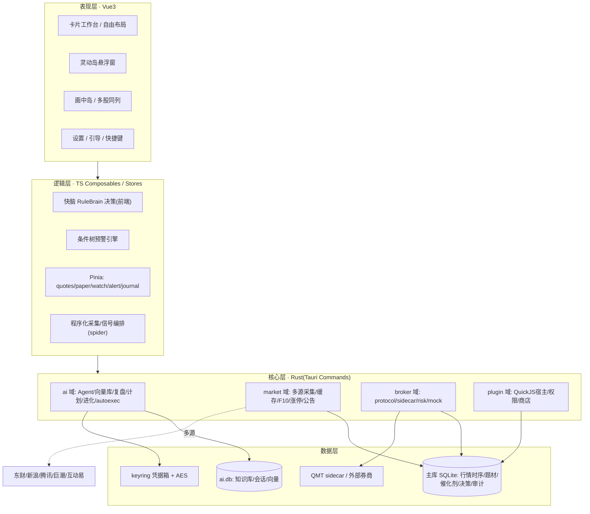
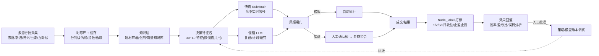
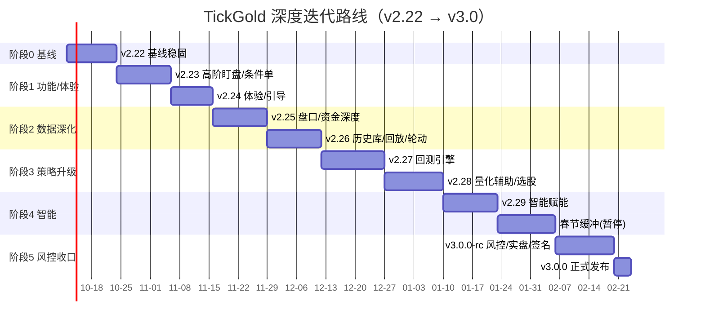
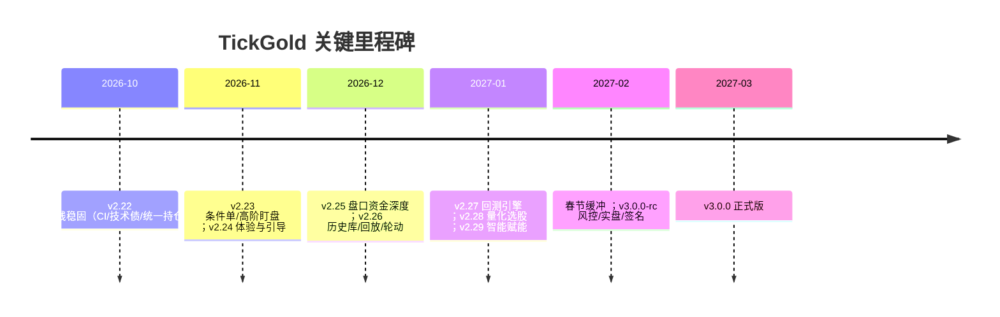
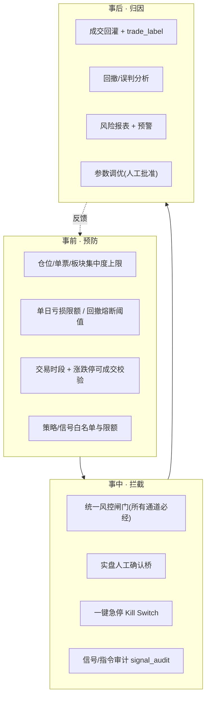

# TickGold・深度迭代开发路线（v2.22 → v3.0）

> **基线版本：v2.21.0**
>
> （以仓库实际代码为准，而非历史规划稿标注的版本号）
> **技术栈：**
>
>  
>
> Tauri 2（Rust 2021）+ Vue 3.5 / TypeScript 5.6 / Pinia / 
>
> Vite 6 + ECharts 6 / KLineCharts / HQChart + SQLite（rusqlite）+ QuickJS（rquickjs）
> **产品定位：**
>
>  A 股短线 / 打板交易者的桌面盯盘工作台 —— 打开就看盘，决策不切换。
> **本文目标：**
>
>  立足现有能力、不重复造轮子，沿「功能补全・体验优化・策略升级・数据深化・智能赋能」五条主线分阶段迭代，打造覆盖 
>
> **实时盯盘 → 行情解析 → 信号预警 → 策略参考 → 风险管控**
>
>  的全流程辅助工具。
> **排期口径：**
>
>  单人全职 + AI 辅助，工作日（PD）估算；开工锚点 2026-10-12（周一），总周期约 20 个工作周，含 2027 春节缓冲，v3.0 计划 2027-03 初收口。
> **更新日期：**
>
>  2026-10-10

***

## 第一部分・现状深度复盘

### 1.1 能力地图（v2.21.0 实际落地）

| 能力域            | 已落地能力                                                                                                                                                            | 关键代码位置（可复用资产）                                                                                                                                                                                                                                                      |
| -------------- | ---------------------------------------------------------------------------------------------------------------------------------------------------------------- | ------------------------------------------------------------------------------------------------------------------------------------------------------------------------------------------------------------------------------------------------------------------ |
| **工作台 / 终端形态** | 卡片自由布局 + 磁吸 resize、多套命名布局保存切换、卡内微件编排（30 套出厂模板）、单卡聚焦、画中岛置顶窗、灵动岛悬浮窗、系统托盘、老板键、场景自动切换                                                                                | `App.vue`、`components/spider/*`、`components/widgets/*`、`composables/workbench/useFreeLayout.ts`、`components/Island.vue`、`components/pip/PipWindow.vue`                                                                                                             |
| **行情 / 数据采集**  | 东财 / 新浪 / 腾讯 / 巨潮 / 互动易多源竞速、逐源容灾、熔断退避、全局并发闸门、全市场榜单（5000+）、五档盘口、K 线 / 分时、F10、涨停数据、公告采集、本地缓存                                                                       | `src-tauri/src/market/*`（`mod.rs`/`eastmoney.rs`/`tencent.rs`/`sina.rs`/`f10.rs`/`limitup.rs`/`announce.rs`/`cninfo.rs`/`irminteract.rs`/`cache.rs`）                                                                                                               |
| **本地时序 / 题材**  | 盘中每分钟情绪 / 指数、每 5 分钟板块写 SQLite，收盘日级快照；涨停归因（概念 / 行业聚类）、题材生命周期（萌芽 / 发酵 / 高潮 / 退潮）、成分角色（龙一 / 龙二 / 助攻 / 跟风）、催化剂事件库（半衰期新鲜度）                                            | `src-tauri/src/market/spider.rs`、`src/kb/*`、`components/SectorHeatmap.vue`、`components/SectorEvents.vue`、`components/MarketHeatMatrix.vue`                                                                                                                         |
| **预警**         | v2 条件树引擎：递归 AND/OR、技术指标 / 盘口 / 竞价上下文、边沿触发、冷却去重、触发历史持久化、系统通知 + 提示音 + 灵动岛推送                                                                                        | `src/alert/*`（`evaluate.ts`/`gates.ts`/`bus.ts`/`repo.ts`）、`src/stores/alertV2.ts`、`components/AlertCenter.vue`、`components/alert/*`                                                                                                                               |
| **AI 双脑**      | **慢脑**：Agent 工具循环、向量库（f32 余弦）、知识库（PDF / 每日自动入库）、盘后三层复盘、次日作战计划、云端 / 本地 Ollama provider；**快脑**：RuleBrain 因子加权→sigmoid 四类概率、盘中实时信号；**进化**：trade\_label 打标、效果回灌、版本对照 | `src-tauri/src/ai/*`（`agent.rs`/`tools.rs`/`vectordb.rs`/`provider.rs`/`fastbrain.rs`/`decision.rs`/`review.rs`/`plan.rs`/`evolution.rs`/`autoexec.rs`/`intraday.rs`）、`src/ai/*`、`components/AiAssistant.vue`、`AiReview.vue`、`BattlePlan.vue`、`EvolutionStats.vue` |
| **交易 / 券商**    | 模拟交易（A 股 T+1、完整费用、可注入 / 重置）、信号人工确认桥（BUY/SELL 落待确认单、改价改量、生成券商指令、唤起券商、signal\_audit 审计）、指令模板、全局 / 卡片快捷键、QMT Python sidecar（已打包资源）、风控模块                             | `src/stores/paper.ts`、`components/PaperTrade.vue`、`SignalBridge.vue`、`TradeDeck.vue`、`src-tauri/src/broker/*`（`protocol.rs`/`sidecar.rs`/`risk.rs`/`mock.rs`）、`resources/broker/sidecar_qmt.py`                                                                    |
| **插件生态**       | QuickJS 脚本宿主、插件清单 / 权限 / 商店、卡片微件宿主、2 个示例插件（bias-indicator、quote-banner）                                                                                          | `src-tauri/src/plugin/*`（`host.rs`/`engine.rs`/`manifest.rs`/`permission.rs`/`store.rs`）、`src/plugin/*`、`components/widgets/PluginWidgetHost.vue`                                                                                                                  |
| **盯盘专项卡片**     | 集合竞价、涨停雷达 / 连板梯队、涨停池、龙虎榜、板块行情 / 热力 / 异动、市场宽度、短线精灵、条件选股 / 筛子、盯盘日记、财经 / IPO 日历、计算工具、数据导出、9 套主题 + 皮肤包协议                                                             | `components/AuctionBoard.vue`、`LimitRadar.vue`、`LimitPool.vue`、`DragonTiger.vue`、`Screener.vue`、`SieveCard.vue`、`ShortTermSpider.vue`、`Journal.vue`、`EcoCalendar.vue`、`IpoCalendar.vue`、`CalcTools.vue`、`DataExport.vue`                                           |
| **工程化**        | Vitest 单测、Playwright E2E（含 28 卡 fps≥50 性能基线）、GitHub Actions、minisign 在线更新（多镜像容灾）、Win NSIS 安装（安装前 DB 自动备份）                                                        | `tests/`、`playwright.config.ts`、`.github/`、`windows/hooks.nsh`                                                                                                                                                                                                     |

### 1.2 技术架构现状

### 1.3 必须复用、不得重造的核心资产

1. **多源容灾采集框架**（熔断 / 竞速 / 并发闸门）—— 所有新数据需求优先接入，禁止另写 HTTP 抓取。

2. **条件树预警引擎 v2**（AND/OR + gates + 边沿触发 + 冷却）—— 新预警类型只新增「字段 / 算子」，不重写引擎。

3. **决策特征包 + 双脑接口**（快脑 RuleBrain / 慢脑 Agent 共用特征）—— 回测、选股、智能解读均复用同一套特征。

4. **信号人工确认桥 + signal\_audit**—— 实盘、条件单、智能下单全部走确认桥与审计，不开旁路。

5. **卡片 / 微件 / 布局体系 + 皮肤协议**—— 新功能一律卡片化、微件化，不新增孤立窗口。

6. **插件宿主（QuickJS）+ 插件商店**—— 可外置的指标 / 数据源 / 策略优先做成插件。

7. **双库迁移机制 + 安装前备份**—— 新表只追加迁移版本，不改动历史迁移。

### 1.4 差距、短板与技术债

| 级别    | 问题                                                                                                                     | 影响                 | 处置版本        |
| ----- | ---------------------------------------------------------------------------------------------------------------------- | ------------------ | ----------- |
| 🔴 P0 | Rust 22 个 warning（`buy_score`/`sell_score`/`rank`/`get_cursor`/`set_cursor`/`MemSecret::new`/`sidecar.kill` 等死代码与未读字段） | 噪音掩盖真实问题、包体增大      | v2.22       |
| 🔴 P0 | 巨石模块未拆：`lib.rs`1979、`market/eastmoney.rs`1707、`ai/tools.rs`1135、`ai/autoexec.rs`926、`market/mod.rs`1048                | 维护风险高、改一处动全身       | v2.22 起步，持续 |
| 🔴 P0 | `cargo test` / `cargo clippy` 未纳入 CI；Rust 测试覆盖薄                                                                        | 后端回归无护栏            | v2.22       |
| 🔴 P0 | `paper` store 与 `broker/mock` 两套持仓 / 成交体系并存                                                                            | 对账口径不一致、模拟 / 实盘难统一 | v2.22       |
| 🟡 P1 | 无本地条件单 / 预埋单引擎（止盈止损、价格触发单需人工盯）                                                                                         | 盯盘离开即失控            | v2.23       |
| 🟡 P1 | 灵动岛预警 / 信号 / 委托 tab 数据非事件驱动、存在不同步                                                                                      | 关键信号可能漏看           | v2.23       |
| 🟡 P1 | 新用户上手门槛高（插件、券商、规则脑指标看不懂）                                                                                               | 留存低                | v2.24       |
| 🟡 P1 | 仅暗色、卡片样式 / 字号 / 圆角不统一、操作反馈弱                                                                                            | 专业感与一致性不足          | v2.24       |
| 🟡 P1 | 行情深度不足：仅免费 5 档，委比委差 / 大单 / 逐笔口径弱、无大盘主力全景                                                                               | 盘口决策信息不够           | v2.25       |
| 🟡 P1 | 多年历史库缺失、历史盘面回放弱、板块轮动靠快照积累尚短                                                                                            | 回测 / 复盘 / 轮动无米下炊   | v2.26       |
| 🟢 P2 | 无策略回测引擎、参数寻优；策略 profile 数量少                                                                                            | 策略无法验证、胜率不可知       | v2.27/v2.28 |
| 🟢 P2 | 智能能力偏 "问答"，缺盘中实时解读、信号归因、智能预警推荐、资讯聚合                                                                                    | 智能化停留在被动查询         | v2.29       |
| 🟢 P2 | 无全域风险监控仪表盘；QMT 实盘未真正打通；无代码签名 / 公证；bundle 仅 NSIS（macOS 暂停）                                                              | 专业版 / 实盘 / 分发收口受阻  | v3.0        |

***

## 第二部分・迭代总纲

### 2.1 北极星指标与目标

* **北极星指标（NSM）：** 交易日中「被用户采纳并产生有效操作的信号数 / 日」（信号 → 确认 / 下单 / 加自选 的转化），衡量系统真正进入决策链的程度。

* **用户价值目标：**

1. **不漏**：关键异动 / 信号 0 漏报、灵动岛与各卡数据强一致；

2. **更快**：盘中从行情变化到信号呈现端到端延迟可控（目标 ≤1s，快脑推理 ≤50ms 量级）；

3. **可验**：每个信号 / AI 结论可解释、可回放、可追溯证据；策略上线前可回测；

4. **可控**：风控闸门强制生效、实盘必经人工确认与审计，任何模型不可绕过。

### 2.2 设计原则（继承并强化）

1. **双脑分工**：慢脑（LLM）做研究 / 复盘 / 计划 / 工具调用；快脑（RuleBrain，可插拔 ML sidecar）做盘中实时决策；共用同一套特征与本地数据。

2. **决策权分层**：模拟账户可全自动；实盘只出信号、人工确认；强制风控与审计；**不做投顾、不代客理财**。

3. **数据 → 知识 → 决策 → 回灌闭环**：时序沉淀为题材 / 知识，知识喂养双脑，决策落日志，结果打标回灌。

4. **本地优先、合规透明**：默认本地、数据不出本机；云端 Key 由用户自选并加密；AI 结论必附来源、可核验、可跳转。

5. **策略外置版本化**：打法为带版本号的 strategy\_profile，与模型版本分别管理、可对照可回滚。

6. **不重复造轮子**：新能力优先以「扩展字段 / 算子 / 插件 / 卡片」的方式长在现有框架上。

7. **盯盘基本盘不回归**：每版必过 tsc + 单测 + E2E（含性能基线）才允许发版。

### 2.3 五大方向 → 能力框架

| 方向       | 目标                                  | 落点版本                         |
| -------- | ----------------------------------- | ---------------------------- |
| **功能补全** | 补齐条件单、高阶盯盘、盘口深度、资讯聚合、风险仪表盘等缺口       | v2.23 / v2.25 / v2.29 / v3.0 |
| **体验优化** | 引导上手、视觉统一、亮色模式、动效与反馈、信息密度自适应、快捷键    | v2.24（贯穿）                    |
| **策略升级** | 回测引擎、参数寻优、策略 profile 扩展、选股增强、信号质量评估 | v2.27 / v2.28                |
| **数据深化** | 盘口 / 资金深度、多年历史库、历史回放、板块轮动矩阵、数据治理备份  | v2.25 / v2.26                |
| **智能赋能** | 盘中实时解读、信号归因、智能预警推荐、资讯智能聚合、明日主线      | v2.29                        |

### 2.4 数据 → 知识 → 决策 → 回灌 闭环（全流程主线）

***

## 第三部分・版本路线总览

### 3.1 里程碑总表

| 阶段   | 版本            | 主题         | 关键交付                                      | 周期 (自然日)            | 工作量 (PD) |
| ---- | ------------- | ---------- | ----------------------------------------- | ------------------- | -------- |
| 阶段 0 | **v2.22.0**   | 基线稳固・技术债清零 | 清 warning、巨石拆分起步、Rust CI、双持仓体系合并、向量库 WAL  | 10-12 \~ 10-23      | 9        |
| 阶段 1 | **v2.23.0**   | 高阶盯盘・条件单   | 本地条件单引擎、灵动岛事件驱动同步、多股同列增强、盯盘模板             | 10-24 \~ 11-06      | 11       |
| 阶段 1 | **v2.24.0**   | 体验优化・引导上手  | 首次引导、新手模式、指标说明、亮色模式、视觉统一、操作反馈             | 11-07 \~ 11-17      | 8        |
| 阶段 2 | **v2.25.0**   | 盘口・资金深度    | 委比委差 / 大单监控、大盘主力全景、行业资金排名、成交明细口径          | 11-18 \~ 12-01      | 11       |
| 阶段 2 | **v2.26.0**   | 历史库・回放・轮动  | 多年历史库、历史盘面回放增强、板块快照自建历史 / 轮动矩阵、备份恢复       | 12-02 \~ 12-15      | 11       |
| 阶段 3 | **v2.27.0**   | 回测引擎       | 特征 / 规则脑 /profile 历史回测、胜率 / 盈亏比 / 回撤、参数寻优 | 12-16 \~ 12-31      | 13       |
| 阶段 3 | **v2.28.0**   | 量化辅助・选股增强  | profile 扩展、涨停战法 / 资金共振选股、信号质量评估、策略对比      | 2027-01-01 \~ 01-15 | 10       |
| 阶段 4 | **v2.29.0**   | 智能赋能       | 盘中实时解读、信号归因、智能预警推荐、资讯智能聚合、明日主线            | 01-16 \~ 01-29      | 11       |
| —    | （缓冲）          | 春节暂停       | 2027 春节约 2 月上旬，预留 2 周                     | 02-01 \~ 02-14      | —        |
| 阶段 5 | **v3.0.0-rc** | 风险管控・实盘・收口 | 全域风险仪表盘、QMT 实盘分级放开、签名公证、macOS 恢复、全量回归     | 02-15 \~ 03-01      | 11       |
| 阶段 5 | **v3.0.0**    | 正式版        | 全平台签名安装包、稳定 API、文档定稿、正式发布                 | 03-01 当周            | 3        |

> 合计约 
>
> **98 个工作日（≈20 工作周，含春节缓冲）**
>
> 。每版独立可发布、可灰度；如遇盘中真实联调阻塞，按「先模拟闭环、后实盘」顺延，不砍验收标准。

### 3.2 路线甘特图（示意，按周顺延）

### 3.3 里程碑时间线

***

## 第四部分・分版本详细任务

> 标注约定：
>
> **【复用】**
>
>  直接使用现有能力；
>
> **【增强】**
>
>  在现有模块上扩展；
>
> **【新建】**
>
>  新增模块 / 表 / 卡片。

### v2.22.0 — 基线稳固・技术债清零

**目标：** 把后续大改的地基夯实，建立后端回归护栏，统一持仓口径。

| # | 任务                                                                                                         | 类型      | 涉及文件                                                                                        | PD  | 验收标准                                  |
| - | ---------------------------------------------------------------------------------------------------------- | ------- | ------------------------------------------------------------------------------------------- | --- | ------------------------------------- |
| 1 | 清理 22 个 warning：删除真死代码（`buy_score`/`sell_score`/`rank`/`get_cursor`/`set_cursor` 等），对保留项加 `#[allow]` 并注释用途 | 增强      | `ai/fastbrain.rs`、`ai/vectordb.rs`、`market/eastmoney.rs`、`broker/sidecar.rs`、`ai/config.rs` | 1.5 | `cargo clippy` 无 warning（或仅剩显式 allow） |
| 2 | 统一 Rust 错误处理：约定 `Result<T, AppError>`（thiserror 或统一枚举），替换散落的 `String` 错误                                   | 增强      | 新增 `src-tauri/src/error.rs`，逐域接入                                                            | 2   | 跨域错误类型一致、可 downcast、命令层统一转换           |
| 3 | 巨石拆分（第一步，低风险抽离）：从 `lib.rs` 抽出迁移定义、命令注册、窗口 / 托盘初始化                                                          | 增强      | `lib.rs` → `db/migrations.rs`、`commands.rs`、`setup.rs`                                      | 2   | 行为不变、迁移与命令数量与拆分前逐一核对一致                |
| 4 | **合并两套持仓体系**为统一 `PortfolioStore`（paper 与 broker/mock 同口径：持仓 / 成交 / 资金 / 费用）                                | 新建 + 复用 | `src/stores/paper.ts`、`broker/mock.rs`、新增统一适配层                                              | 2   | 模拟 / 实盘对账一致；切换通道不丢数据；旧数据可迁移           |
| 5 | 向量库启用 WAL + 连接单例，防锁库；写后 checkpoint                                                                         | 增强      | `ai/vectordb.rs`                                                                            | 0.5 | 并发读写不锁、长时间运行无 database is locked      |
| 6 | `cargo test` + `cargo clippy` 加入 GitHub Actions（与 frontend/e2e 并列，失败阻断合并）                                  | 增强      | `.github/workflows/*`                                                                       | 1   | PR 上后端检查必跑、失败红灯                       |
| 7 | 补关键模块单测：fastbrain /intraday/ 预警 evaluate / 持仓费用                                                            | 增强      | `src-tauri/tests` 或内联 `#[cfg(test)]`                                                        | 1   | 核心纯逻辑覆盖率显著提升、测试可离线跑                   |

**发版验收：** `cargo clippy/test` 全绿且进 CI；`vue-tsc` + 前端单测 + E2E（性能基线）全绿；启动→切场景→问 AI→模拟买入→灵动岛冒烟通过；迁移与命令清单核对无缺失。

***

### v2.23.0 — 高阶盯盘・条件单

**目标：** 解决 "人离开盘口就失控"，并让灵动岛与各卡数据强一致。

| # | 任务                                                              | 类型                        | 涉及文件                                                                    | PD  | 验收标准                               |
| - | --------------------------------------------------------------- | ------------------------- | ----------------------------------------------------------------------- | --- | ---------------------------------- |
| 1 | **本地条件单引擎**：止盈 / 止损、价格上穿下穿、涨跌幅、量比、涨停炸板等触发单；触发后走确认桥（模拟可自动、实盘出指令） | 新建（复用预警 gates + 确认桥 + 风控） | 新增 `src-tauri/src/broker/conditional.rs`；复用 `alert/gates`               | 3   | 条件单边沿触发、冷却去重；触发即写审计；关机 / 重启后条件单仍生效 |
| 2 | 条件单管理卡片：列表 / 新建 / 启停 / 改价改量 / 触发历史                              | 新建（卡片化）                   | `components/ConditionalOrders.vue`、注册 CARD\_META                        | 1.5 | CRUD 完整、与持仓 / 自选联动                 |
| 3 | **灵动岛事件驱动同步**：预警 / 信号 / 委托三 tab 统一事件总线 + 1s 兜底轮询                | 增强                        | `components/Island.vue`、`alert/bus.ts`、信号 emit                          | 1.5 | 信号产生到岛上呈现 ≤1s；断线重连后自动补齐            |
| 4 | 多股同列增强：2×2 / 多格分时与迷你 K 线、批量盘口、同步十字光标                            | 增强                        | `components/MultiStockGrid.vue`、`MultiCell.vue`、`widgets/KlineMini.vue` | 2   | 一屏监控 ≥4 只、分时实时、点击联动主卡              |
| 5 | 盯盘模板：打板 / 低吸 / 竞价 / 趋势 等一键布局（含卡片槽位 + 默认预警 / 条件单）                | 增强（复用布局与场景）               | `composables/useDockGroups.ts`、场景模板                                     | 1.5 | 模板可一键应用、可另存为自定义                    |
| 6 | 全局 / 卡片快捷键补齐：切卡、唤起确认桥、撤单、加自选                                    | 增强                        | `composables/useActions.ts`、`ShortcutDialog.vue`                        | 1   | 快捷键表与实际一致、可自定义                     |
| 7 | 断网 / 数据源故障安全降级：不出错误信号、明确状态提示                                    | 增强                        | market 容灾 + 前端状态                                                        | 0.5 | 故障时不白屏、不误报，恢复后自动续跑                 |

**发版验收：** 条件单在模拟盘完成 "设定→触发→执行 / 出指令→审计" 闭环；灵动岛与卡片强一致；多股同列实时；全套测试 + E2E 绿。

***

### v2.24.0 — 体验优化・引导上手

**目标：** 新用户 5 分钟上手，全界面视觉与交互统一。

| # | 任务                                                | 类型 | 涉及文件                                                              | PD  | 验收标准                  |
| - | ------------------------------------------------- | -- | ----------------------------------------------------------------- | --- | --------------------- |
| 1 | 首次启动引导向导（选行情源→选 AI 模式→选场景 / 布局），可跳过、可重看           | 增强 | `components/OnboardingDialog.vue`                                 | 1.5 | 引导完成后直接可用、配置真实生效      |
| 2 | 新手模式：默认仅模拟盘、隐藏实盘 / 高级项，随等级或手动解锁                   | 增强 | 设置 + 菜单显隐逻辑                                                       | 1   | 模式切换无残留入口、新手不误触实盘     |
| 3 | 规则脑指标 / 风控项 tooltip 说明 + 策略模板释义（金叉 / 超买 / 封单等是什么） | 增强 | `IndicatorSettings.vue`、`ai/indicators.ts`                        | 1   | 每个指标有通俗 + 专业双解释       |
| 4 | **亮色模式** + 主题令牌（design token）化，红涨绿跌全界面统一          | 增强 | `styles/*`、`useTheme.ts`、`ThemeLibrary.vue`                       | 2   | 亮 / 暗切换无对比度问题、涨跌色全局一致 |
| 5 | 视觉统一：卡片圆角 / 阴影 / 字号（标题 14 / 正文 12 / 辅助 10.5）、间距规范 | 增强 | `CardShell.vue`、样式变量                                              | 1   | 全卡样式一致、走统一 token      |
| 6 | 操作反馈与动效：买入 / 卖出 / 触发 toast、数字变化闪烁、卡片淡入上移、预警抖动     | 增强 | `common/AnimatedNumber.vue`、`useMotion.ts`、`alert/AlertToast.vue` | 1   | 关键操作必有反馈、动效不影响性能基线    |
| 7 | 信息密度自适应：小屏（1366×768）折叠侧栏、大屏（2K+）多列                | 增强 | 布局响应式逻辑                                                           | 0.5 | 两档分辨率下布局合理、无遮挡        |

**发版验收：** 新设备走引导 5 分钟内完成首次模拟买入；亮 / 暗双模式无视觉缺陷；视觉走查全卡通过；测试 + E2E（含 fps 基线）绿。

***

### v2.25.0 — 盘口・资金深度

**目标：** 在免费数据口径内把盘口与资金面做到可用于决策。

| # | 任务                                              | 类型              | 涉及文件                     | PD  | 验收标准                 |
| - | ----------------------------------------------- | --------------- | ------------------------ | --- | -------------------- |
| 1 | 盘口深度指标：委比 / 委差、均价、量比、换手率、内外盘、买卖盘强弱              | 增强（复用腾讯 / 东财快照） | market 解析 + 盘口卡片         | 2   | 字段口径正确、与主流软件误差可解释    |
| 2 | 大单 / 异动监控：大单成交、突然放量、急涨急跌、封单变化（免费口径，明确非 Level-2） | 增强              | 复用短线精灵 + 新增计算            | 2   | 异动可推送灵动岛、阈值可配、标注口径限制 |
| 3 | **大盘主力资金全景**：两市主力净流入分时 / 多日趋势                   | 新建（接入资金接口，走容灾）  | `market/*` 资金命令 + 新卡片    | 2   | 分时与多日趋势正确、失败降级提示     |
| 4 | 行业 / 概念资金排名 + 联动成分股                             | 增强              | 资金命令 + `SectorBoard.vue` | 1.5 | 排名可排序、点击联动成分与热力图     |
| 5 | 成交明细 / 逐笔口径（快照推算）与分价成交（如有源）                     | 增强              | `TradeTape.vue`          | 1.5 | 明细实时滚动、明确数据口径与时延     |
| 6 | 个股资金流向卡片增强（四档单 + 多日）                            | 增强              | 现有 fundflow 卡            | 1   | 与大盘资金口径一致            |
| 7 | Level-2 预留：定义十档 / 逐笔委托数据接口抽象（用户自带 Key / 源可插拔）   | 新建（接口层，不承诺数据）   | market 数据 trait + 插件数据源  | 1   | 接口可被插件实现、免费模式明确受限    |

**发版验收：** 盘口 / 资金各字段口径有文档说明；大盘与个股资金一致；异动推送闭环；免费口径限制在 UI 明示；测试 + E2E 绿。

***

### v2.26.0 — 历史库・回放・轮动

**目标：** 为回测、复盘、轮动准备 "米"，并打通数据备份恢复。

| # | 任务                                         | 类型        | 涉及文件                           | PD  | 验收标准               |
| - | ------------------------------------------ | --------- | ------------------------------ | --- | ------------------ |
| 1 | **多年历史库**：日 K / 分钟 K 增量回填与本地存储、复权处理、交易日历   | 新建（走容灾采集） | 新增历史存储表 + 回填命令                 | 3   | 可回填多年、增量更新、复权口径正确  |
| 2 | 历史盘面回放增强：指定日期分时 / 盘口 / 涨停池 / 板块快照回放（倍速、暂停） | 增强        | `MinuteReplayPopup.vue` + 历史快照 | 2   | 任意历史交易日可回放、与当时数据一致 |
| 3 | 板块快照自建历史：每日定时落板块涨跌幅 / 资金 / 涨停家数            | 增强（上线即积累） | market 快照 + 新表                 | 1.5 | 每日自动积累、可补历史指定日     |
| 4 | **题材轮动矩阵**：板块阶段强弱、轮动热力、主线切换识别              | 新建（基于快照）  | 新卡片 /`SectorEvents.vue` 增强     | 2   | 矩阵随积累变完整、可识别主线切换   |
| 5 | 数据备份 / 恢复：本地文件全量 / 增量备份（含主库、ai.db、配置、布局）   | 新建        | 备份命令 + 设置入口                    | 1.5 | 备份可还原、跨版本恢复不丢数据    |
| 6 | 数据治理：时序 / 快照 / 向量过期策略、孤儿数据清理、库体积统计         | 增强        | 复用 v2.2 治理逻辑扩展                 | 1   | 过期策略可配、清理可预览可回滚    |

**发版验收：** 历史库回填与增量更新正确；历史回放与真实当日一致；轮动矩阵上线开始积累；备份→还原演练通过；测试 + E2E 绿。

***

### v2.27.0 — 回测引擎 ★策略里程碑

**目标：** 让规则脑 / 策略 profile 在历史数据上可验证，输出可信绩效。

| # | 任务                                                                      | 类型                | 涉及文件                              | PD  | 验收标准                   |
| - | ----------------------------------------------------------------------- | ----------------- | --------------------------------- | --- | ---------------------- |
| 1 | **回测内核**：基于历史库逐 bar 回放，复用决策特征包与 RuleBrain，模拟 A 股 T+1 / 费用 / 涨跌停 / 流动性约束 | 新建（复用特征 + 统一持仓费用） | 新增 `src-tauri/src/ai/backtest.rs` | 3.5 | 回测撮合口径与模拟盘一致、可逐日核对     |
| 2 | 绩效指标：总收益 / 年化、胜率、盈亏比、最大回撤、夏普、单笔期望、持仓周期、月度收益                             | 新建                | backtest 统计模块                     | 2   | 指标公式正确、可导出             |
| 3 | 参数寻优：因子权重 / 阈值网格搜索、walk-forward（防过拟合）                                   | 新建                | backtest 寻优模块                     | 2.5 | 可批量跑参数组合、样本内外分离、输出稳健性  |
| 4 | 回测卡片：选策略 /profile/ 区间 / 参数 → 运行 → 绩效图（资金曲线 / 回撤 / 月度）+ 交易明细             | 新建（卡片化）           | `components/Backtest.vue`、ECharts | 2.5 | 全流程可视化、结果可保存对比         |
| 5 | 策略对比：多版本 profile / 参数并排绩效对照                                             | 增强                | 回测结果对比视图                          | 1.5 | 多策略同表对照、可标记最优          |
| 6 | 回测结果与进化回灌打通：回测结论仅作调优依据，参数变更**人工批准**                                     | 增强                | `evolution.rs` + 审批流              | 1   | 回测不自动改写线上 profile、全程留痕 |

**发版验收：** 至少 3 套策略在 ≥1 年历史上回测可复现；撮合 / 费用口径与模拟盘一致；防过拟合机制生效；回测报告可导出；测试 + E2E 绿。

***

### v2.28.0 — 量化辅助・选股增强

**目标：** 把回测验证过的打法沉淀为可选股、可跟踪、可评估的量化辅助能力。

| # | 任务                                                       | 类型                       | 涉及文件                                        | PD  | 验收标准                      |
| - | -------------------------------------------------------- | ------------------------ | ------------------------------------------- | --- | ------------------------- |
| 1 | 策略 profile 扩展：龙头 / 1 进 2 / 抄底 / 竞价抢筹 / 低吸 / 趋势 等打法，外置版本化 | 增强                       | `strategy_profile` + `StrategyProfiles.vue` | 2   | 每套含入场 / 仓位 / 止盈止损、可克隆可回滚  |
| 2 | 选股增强：涨停战法（首板 / 连板 / 反包 / 弱转强）、资金共振、题材 + 龙头共振条件           | 增强                       | `Screener.vue`、`SieveCard.vue`、连板选股引擎       | 2.5 | 全市场可选、条件可组合、结果可加自选 / 转条件单 |
| 3 | 连板天梯 / 晋级率 / 溢价 / 封单强度指标（连板选股引擎深化）                       | 增强                       | `LimitRadar.vue`、`连板选股引擎`                   | 1.5 | 梯队 / 晋级率 / 溢价口径正确         |
| 4 | 信号质量评估：信号历史胜率分桶（按打法 / 题材 / 时段），新信号附历史命中率                 | 新建（复用 trade\_label / 回灌） | 信号质量服务 + 信号卡展示                              | 2   | 每个信号显示同型历史命中率与样本数         |
| 5 | 自选 / 候选智能分组：按策略 / 题材自动归类、信号命中高亮                          | 增强                       | `WatchList.vue`                             | 1   | 自动分组准确、与信号 / 条件单联动        |
| 6 | 选股 / 信号结果导出、订阅（每日自动跑并推送）                                 | 增强                       | `DataExport.vue` + 定时任务                     | 1   | 可订阅、结果推送灵动岛 / 通知          |

**发版验收：** 各战法选股结果可追溯条件；信号附历史命中率；profile 全部可回测；订阅推送闭环；测试 + E2E 绿。

***

### v2.29.0 — 智能赋能

**目标：** AI 从 "被动问答" 走向 "盘中主动解读与辅助决策"，仍全程可核验、可关闭。

| # | 任务                                                     | 类型                    | 涉及文件                               | PD  | 验收标准                    |
| - | ------------------------------------------------------ | --------------------- | ---------------------------------- | --- | ----------------------- |
| 1 | **盘中实时解读**：关键异动 / 涨停 / 炸板 / 板块拉升时，慢脑（或本地模型）生成一句话归因，附证据 | 新建（复用事件总线 + Agent 工具） | 盘中解读服务 + 灵动岛 / 卡片                  | 2.5 | 事件触发解读、带来源、可一键看证据、可关闭   |
| 2 | 信号归因解释：快脑信号的触发因子、贡献度、同型历史表现                            | 增强（复用特征 + 信号质量）       | 快脑输出增强 + 前端                        | 1.5 | 每个信号可解释 "为什么触发"         |
| 3 | **智能预警推荐**：根据持仓 / 自选 / 打法，推荐应设的预警与条件单，用户一键采纳           | 新建                    | 预警推荐服务 + AlertRuleDialog           | 2   | 推荐与场景相关、采纳即建、可拒绝        |
| 4 | 资讯智能聚合：财经头条 / 7×24 电报 / 个股板块相关新闻去重聚合 + 要点摘要            | 新建（合规：标题 / 摘要 + 链回原文） | `NewsFlash.vue`/`NewsBar.vue` + 采集 | 2.5 | 多源聚合去重、按标的 / 题材关联、摘要可溯源 |
| 5 | 明日主线参考：题材 + 资讯 + 涨停综合，输出候选主线与观察点（明确非投资建议）              | 增强（复用作战计划）            | `BattlePlan.vue` + 慢脑              | 1.5 | 结论结构化、逐条挂证据、显著免责声明      |
| 6 | AI 安全与成本：本地 / 云端路由、限流、失败降级、敏感操作二次确认                    | 增强                    | `provider.rs` + 前端                 | 1   | 数据外发透明、成本可控、故障安全降级      |

**发版验收：** 盘中解读在真实交易日可用且不打扰（可配阈值 / 开关）；所有 AI 文案可点证据；资讯聚合合规；测试 + E2E 绿。

***

### v3.0.0-rc — 风险管控・实盘・收口

**目标：** 建立全域风险管控，分级打通 QMT 实盘，完成签名与多平台收口。

| # | 任务                                                                     | 类型                        | 涉及文件                                               | PD  | 验收标准                               |
| - | ---------------------------------------------------------------------- | ------------------------- | -------------------------------------------------- | --- | ---------------------------------- |
| 1 | **全域风险监控仪表盘**：账户权益 / 仓位 / 集中度、当日与累计回撤、单票 / 板块暴露、持仓盈亏、止损触发、市场情绪 / 系统性风险 | 新建（复用风控 + 时序 + 持仓）        | `components/RiskDashboard.vue`、`broker/risk.rs` 增强 | 3   | 风险指标实时、阈值预警、超限强制提示 / 拦截            |
| 2 | 风控闸门体系化：仓位上限、单票上限、回撤熔断、涨跌停 / 时段约束、单日亏损限额，执行层强制、模型不可绕过                  | 增强                        | `broker/risk.rs`、autoexec / 条件单 / 确认桥统一接入          | 2   | 所有下单通道过同一闸门、绕过即失败并有日志              |
| 3 | **QMT 实盘分级放开**：先 "只出信号 + 人工确认"，稳定后在用户授权下放开半自动（仍逐笔 / 限额可配）              | 增强（复用 sidecar + 确认桥 + 审计） | `sidecar_qmt.py`、`broker/*`、SignalBridge           | 2.5 | 实盘指令可追溯、限额 / 熔断生效、可一键急停            |
| 4 | 一键急停（kill switch）：全局快捷键 / 按钮，立即停止所有自动交易并撤条件单                           | 新建                        | autoexec / 条件单 + 全局快捷键                             | 0.5 | 急停即时生效、状态明确、恢复需手动                  |
| 5 | 代码签名 / 公证：Windows Authenticode、macOS 公证；恢复 macOS bundle target         | 增强                        | CI + tauri.conf + 签名密钥                             | 1.5 | 无 SmartScreen/Gatekeeper 拦截、双平台包可装 |
| 6 | 全量回归与文档定稿：用户手册 / 数据源 / 快捷键 / FAQ、API 稳定性冻结                             | 增强                        | docs/\*、README                                     | 1.5 | 文档与功能一致、API 标记稳定                   |

**rc 验收：** 风险仪表盘覆盖全部持仓与下单通道；实盘在最小限额下完成真实周联调、风控零绕过、急停有效；双平台签名包可装；全量回归绿。

### v3.0.0 — 正式版

* [ ] 连续 ≥3 个版本在线更新无失败、多镜像容灾生效；

* [ ] 升级安装数据零丢失（迁移 + 安装前备份验证）；

* [ ] 全平台签名安装包、稳定 API、完整 README/Wiki/ 手册；

* [ ] 发布评审通过（对照 DoD），打 `v3.0.0` 正式标签并发布。

***

## 第五部分・风险监控与合规体系

### 5.1 风控分层

### 5.2 合规红线（不可逾越）

1. **不做投资顾问、不代客理财、不承诺收益、不做确定性走势预测 / 目标价**；只做技术信号与概率参考。

2. **实盘仅面向用户本人授权账户**，默认信号 + 人工确认；任何自动执行需用户显式开启、限额、可急停，并遵守券商与监管规定。

3. **数据合规**：免费公开接口仅作学习与个人盯盘；资讯仅展示标题 / 摘要并链回原文，不全文转载；遵守各数据源条款。

4. **隐私透明**：本地优先、数据不出本机为默认；云端模型与 Key 用户自选、keyring 加密；明确告知哪些数据会外发。

5. 所有 AI 输出标注 "辅助信息、非投资建议"，交易决策与后果由用户自行承担。

***

## 第六部分・工程保障

### 6.1 测试金字塔与质量护栏

| 层级        | 工具                         | 范围                           | 门槛                                  |
| --------- | -------------------------- | ---------------------------- | ----------------------------------- |
| 类型 / 静态检查 | vue-tsc、cargo check/clippy | 全量前后端                        | 0 error、clippy 0 warning（或显式 allow） |
| 单元测试      | Vitest、cargo test          | 纯逻辑 / 因子 / 费用 / 预警 / 回测统计    | 全绿，核心模块覆盖率持续提升                      |
| 集成 / E2E  | Playwright                 | 关键链路 + 28 卡 fps≥50 性能基线      | 全绿、性能不回退                            |
| 长时间浸泡     | 手动 / 定时                    | 4h 内存与稳定性、无锁库 / 泄漏           | 内存平稳、无崩溃                            |
| 真实盘中联调    | 手动                         | 竞价 / 信号 / 条件单 / 灵动岛 / 实盘最小限额 | 交易周内闭环、风控零绕过                        |

### 6.2 标准发版流程（每版必走）

1. 在现有框架上扩展（market 命令 / 预警字段 / 卡片 / 插件），不另起炉灶；

2. 前端 `api` 封装 + TS 类型 → 卡片 / 微件注册（CARD\_META、CardContent 分支、菜单、命令面板）；

3. 新增表只追加迁移版本；bump 版本四处统一（`tauri.conf.json`、`package.json`、`Cargo.toml`、`Cargo.lock`）；

4. `vue-tsc` + Vitest + `cargo clippy/test` + Playwright（含性能基线）全绿；

5. commit /push/tag /push tag（推送失败走 Git Data API）；CI 三平台 + publish；

6. 软件内更新全链路实测；**同步更新 README 与用户手册**。

### 6.3 版本发布 Definition of Done

* [ ] 全部计划任务交付，未完成项有明确说明与影响评估；

* [ ] 静态检查 / 单测 / E2E / 性能基线全绿，后端检查已在 CI 强制；

* [ ] 关键链路手动冒烟 + 真实时段联调通过；

* [ ] 数据迁移与备份 / 还原验证通过，升级不丢数据；

* [ ] 新功能卡片化、可在菜单 / 命令面板检索；文档与功能一致。

***

## 第七部分・度量与成功指标

| 维度    | 指标                   | 目标                     |
| ----- | -------------------- | ---------------------- |
| 核心价值  | 日被采纳有效信号数（北极星）       | 持续增长；信号→操作转化率提升        |
| 及时性   | 行情变化→信号呈现端到端延迟       | ≤1s；快脑推理 ≤50ms 量级      |
| 可靠性   | 关键信号漏报率、崩溃率、在线更新成功率  | 漏报≈0；崩溃率趋零；更新连续成功      |
| 性能    | 28 卡 fps、长时间内存增长     | fps≥50；4h 浸泡无明显泄漏 / 锁库 |
| 策略有效性 | 回测 / 实盘信号胜率、盈亏比、最大回撤 | 可量化、可对照；调优全程人工批准       |
| 风控    | 风控闸门绕过次数、急停有效性       | 绕过 = 0；急停 100% 有效      |
| 上手    | 新用户首次完成模拟买入时间        | ≤5 分钟                  |

***

## 第八部分・风险登记册

| 风险                     | 概率 | 影响 | 应对                                      |
| ---------------------- | -- | -- | --------------------------------------- |
| 免费数据源不稳定 / 字段变更、历史接口废弃 | 高  | 高  | 多源容灾 + 快照自建历史；字段以开盘实测为准；失败降级提示          |
| 回测过拟合、绩效与实盘背离          | 中  | 高  | walk-forward、样本内外分离、A 股真实约束；回测仅作依据、人工批准 |
| 实盘连接 / 合规风险            | 中  | 高  | 默认人工确认、最小限额、统一风控、全程审计、一键急停；不做投顾         |
| 巨石拆分引入回归               | 中  | 中  | 先补测试再抽离、行为对照、小步提交                       |
| 双持仓体系合并影响现有模拟盘         | 中  | 中  | 适配层 + 数据迁移 + 对账核对、保留回滚路径                |
| 单人开发周期受春节 / 联调阻塞       | 中  | 中  | 相对周排期、预留缓冲、先模拟闭环后实盘、每版可独立发布             |
| AI 盘中解读打扰 / 外发数据       | 中  | 中  | 阈值与开关、本地优先、外发透明、可一键关闭                   |

***

## 第九部分・立即行动清单（Next Actions）

**本周（v2.22.0 启动）：**

* [ ] 清理 Rust 22 个 warning，建立 `cargo clippy/test` CI 任务；

* [ ] 抽离 `lib.rs` 迁移 / 命令 /setup（先补对照清单）；

* [ ] 启动统一 `PortfolioStore` 设计与对账；

* [ ] 向量库启用 WAL；

* [ ] 建立统一错误类型 `error.rs`。

**下阶段（v2.23.0）：** 条件单引擎设计（复用预警 gates + 确认桥 + 风控）、灵动岛事件总线。

**贯穿始终：** 每个新能力先问 "能否复用 / 扩展 / 插件化"，守护盯盘基本盘不回归。

***

## 免责声明

TickGold 行情数据来自公开免费接口，仅供学习与个人盯盘参考，不保证实时性与准确性，**不构成任何投资建议**。AI 输出均为辅助信息，所有交易决策与结果由用户自行承担；实盘对接仅面向用户本人授权账户，须遵守相关券商与监管规定，本项目不提供投资顾问或代客理财服务。