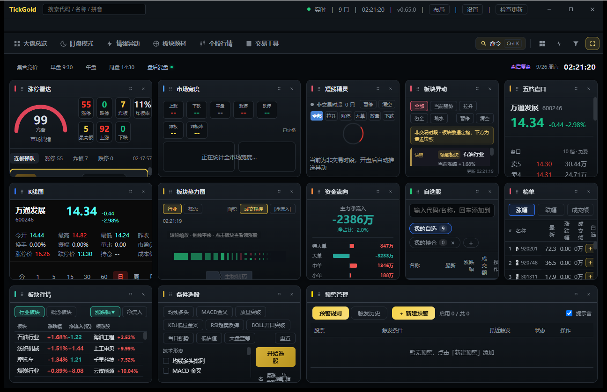

# TickGold 文档中心

TickGold 是一款**开源、跨平台的 A 股盯盘桌面终端**（Tauri 2 + Rust + Vue 3 + TypeScript），提供实时行情、智能预警、分时复盘、模拟交易等能力，一套代码同时发布 Windows 与 macOS。

- 仓库地址：<https://github.com/mhxy881126/tickgold>
- 开源协议：[MIT](../LICENSE)
- 最新版本：见 [Releases](https://github.com/mhxy881126/tickgold/releases)

## 快速开始

1. 前往 [Releases](https://github.com/mhxy881126/tickgold/releases/latest) 下载对应平台安装包；
2. Windows 运行 `TickGold_*_x64-setup.exe`，macOS 挂载 `.dmg` 后拖入「应用程序」；
3. 首次启动会进入新手引导，按提示选择主题即可；
4. 在「自选股」中搜索添加标的，开始盯盘。

详细安装步骤见 [用户手册 · 安装与卸载](用户手册.md)。

## 文档目录

| 文档 | 内容 |
| --- | --- |
| [用户手册](用户手册.md) | 安装卸载、界面总览、各项功能、设置、自动更新、数据与隐私 |
| [键盘快捷键](快捷键表.md) | 完整快捷键列表（与应用内速查面板一致） |
| [数据源说明](数据源说明.md) | 行情接口、字段口径、已知限制、本地数据目录与缓存 |
| [第三方 License](第三方License.md) | 前端与 Rust 依赖清单、开源协议合规说明 |
| [截图与演示](截图与演示.md) | 官方截图、待补截图拍摄步骤、演示视频脚本与录制指引 |
| [常见问题 FAQ](常见问题.md) | 安装、更新、数据目录、行情、快捷键等高频问题 |

## 项目概览

- **技术栈**：Tauri 2（Rust 后端 + WebView）、Vue 3 + TypeScript + Pinia、KLineChart / ECharts；
- **数据源**：腾讯行情公开免费接口（多源容灾），详见 [数据源说明](数据源说明.md)；
- **本地优先**：自选股、布局、预警、日记等均保存在本地 SQLite，不上传服务器；
- **自动更新**：多镜像容灾 + minisign 签名校验 + 安装前数据库备份，详见 [用户手册 · 自动更新](用户手册.md#六自动更新)。

## 免责声明

行情数据来自公开免费接口，仅供学习与个人盯盘参考，不保证实时性与准确性，**不构成任何投资建议**。本项目不提供真实委托下单（需券商资质），仅可用于模拟交易。
