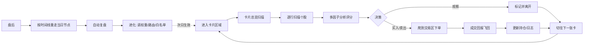
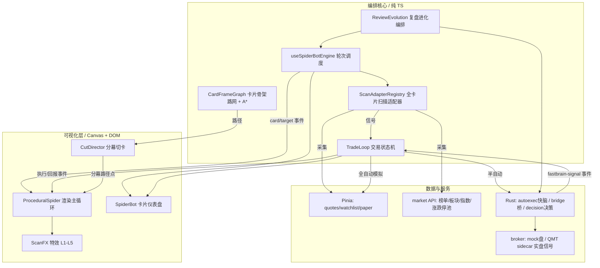
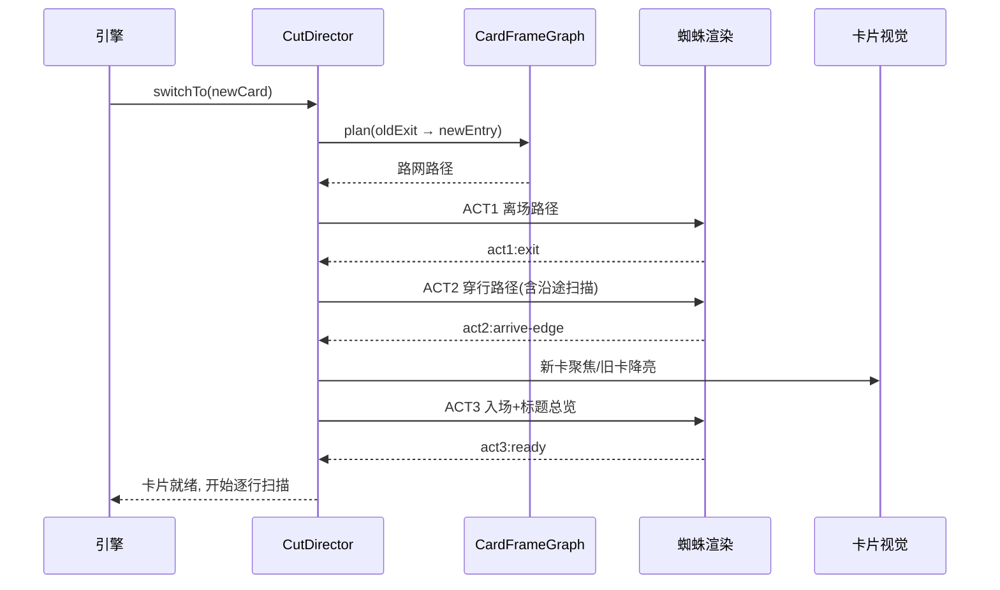
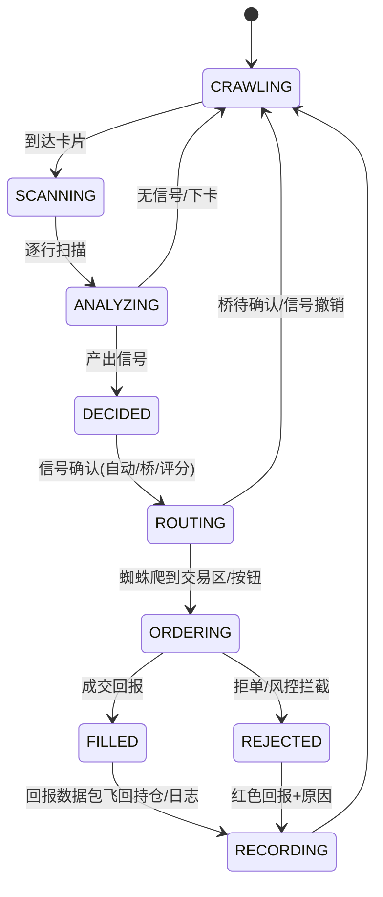
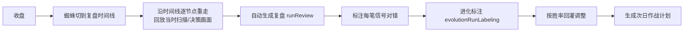

# AI 蜘蛛爬行机器人・功能优化与落地方案（v3）

> 日期：2026-10-09
> 状态：待评审
> 适用版本：TickGold 灵动岛版（程序化 IK 蜘蛛已上线）
> 关联文档：
> `docs/superpowers/specs/2026-10-08-procedural-spider-crawler-design.md`
>
> （IK 蜘蛛设计，已落地）
> `docs/superpowers/specs/2026-10-09-spider-bot-card-redesign.md`
>
> （蜘蛛卡片仪表盘，已落地）
> `docs/superpowers/plans/2026-10-08-procedural-spider-crawler.md`
>
> （上一期实施计划）
> **一句话目标**
>
> ：让蜘蛛像真人交易员一样，在
>
> **全部卡片**
>
> 之间沿卡片结构真实爬行，完成「浏览 → 总览 → 逐行扫描 → 分析 → 决策 → 下单 → 成交回报 → 记录 → 盘后复盘 → 进化」的完整闭环，而不只是播放动画。


***

## 一、现状诊断

### 1.1 已具备的能力（不回退）


| 能力                                                      | 实现位置                                                                         | 状态             |
| ------------------------------------------------------- | ---------------------------------------------------------------------------- | -------------- |
| Canvas 2D 全屏 IK 蜘蛛（8 腿、两段式逆运动学、对角 trot 步态、位移驱动无滑步、滑行扫描） | `spider/ik.ts`、`spider/sim.ts`、`spider/ProceduralSpider.vue`                 | ✅ 可用           |
| 行扫描光束、行框脉冲、四角高亮、数据粒子流                                   | `ProceduralSpider.vue` draw()                                                | ✅ 代码齐全         |
| 数据包 抽出→拖行→曲线飞行→消散                                       | `sim.ts` updatePackets()                                                     | ✅ 可用           |
| 自选股真实多因子评分 + 风控买卖                                       | `useSpiderBotEngine.ts` scanWatchlist/executeBuy/executeSell                 | ✅ 可用           |
| 涨幅榜 / 行业 / 概念 / 大盘 / 雷达 真实数据扫描函数                        | `useSpiderBotEngine.ts` scanRank/scanSector/scanConcept/scanMarket/scanRadar | ⚠️ 仅可视化，不评分不交易 |
| 后端快脑自动执行器（模拟盘全自动、实盘只发信号、硬止损强制执行）                        | `ai/autoexec.rs`、`ai/fastbrain.rs`、`ai/decision.rs`                          | ✅ 可用           |
| 信号确认桥（半自动人工确认）                                          | `ai/bridge.rs`、`signalCreateSpider`                                          | ✅ 可用           |
| 复盘、进化标注、券商通道（mock + QMT sidecar）                        | `ai/review.rs`、`ai/evolution.rs`、`broker/`                                   | ✅ 后端就绪         |

### 1.2 用户反馈 6 个问题的代码级根因


| # | 问题表象                  | 代码级根因                                                                                                                                                                                                                                                          | 证据                                                             |
| - | --------------------- | -------------------------------------------------------------------------------------------------------------------------------------------------------------------------------------------------------------------------------------------------------------- | -------------------------------------------------------------- |
| 1 | 跨卡像空中飞行，没有沿面板边框 / 标题爬 | 跨卡路径只有两种：`edgeRoute` 贴**屏幕最外缘**绕大圈；`naturalWaypoints` 是 S 形自由曲线，会穿过卡片间空白区甚至其他卡片。**不存在 "卡片骨架路网"**，落脚点没有锚定在卡片边框 / 标题栏 / 面板分隔条上                                                                                                                                   | `ProceduralSpider.vue` L182、L205-211                           |
| 2 | 不会扫描卡片里的个股            | 引擎只认识 8 个爬取源；`scanRound` 的 switch 中 `dragon/screener` 仅打日志；**集合竞价、短线精灵、题材库、板块异动、涨停池、连板选股器、逐笔成交、快讯**等卡片完全没有扫描分析；rank/sector 等只发可视化事件，**不对个股调用&#x20;**`evaluateStock`，无信号即无交易                                                                                    | `useSpiderBotEngine.ts` L53-72、L895-926                        |
| 3 | 自动买卖不完整               | executeBuy/executeSell **只在 scanWatchlist 中被调用**；其他卡片信号不进交易管道。后端成交后 emit 的 `fastbrain-signal` 事件**只有 DecisionLog.vue 监听**，蜘蛛层不监听 → 看不到 "下单→成交→回报"。前端 paperStore 成交与后端 autoexec 成交是两套状态，未统一                                                                     | `useSpiderBotEngine.ts` L420-436；全局搜索 `fastbrain-signal` 仅 1 处 |
| 4 | 步态路径、切卡效果不完整          | 切卡是 `planCard` 直接 `resetPath`，没有 "离场→穿行→入场" 分幕；没有新卡聚焦亮起 / 旧卡降亮的视觉呼应；沿标题栏经过时不会 "顺手扫一下"                                                                                                                                                                          | `ProceduralSpider.vue` planCard L130-314                       |
| 5 | 引擎扫描卡片不完整             | `getCardPriority` 只覆盖 8 张卡；`collectFromStore` 中 sector/concept/market/radar 大量 **mock 假数据**，且在真实 scan 之后 300ms 用假 points **覆盖** `targetPoints`，造成面板数据闪烁 / 失真；多数卡片无 scan 函数                                                                                     | `useSpiderBotEngine.ts` L231-334、L855-860                      |
| 6 | 看不到扫描视觉效果             | 特效代码其实存在，但触发链断裂：① **龙虎榜选择器失效**（配置 `.list-row/.stock-item`，真实 DOM 是 `.stock-row`；extract 配置 `.name/.pct`，真实是 `.sr-code/.sr-name/.sr-pct`）→ 龙虎榜永远采不到行；② 卡片关闭时 DOM 不存在，autoDiscover 只找固定 8 张；③ 特效仅在 "非 via 且 anchor.width>0" 时触发，重试期最长约 2s 只有主锚点一下；④ 无选择器自检，失效无告警 | `anchors.ts` L170-183 对比 `DragonTiger.vue` L207-217            |

> 已核验选择器匹配情况：watch ✅、rank ✅、sector ✅、concept ✅、market (
>
> `.idx`
>
> ) ✅、radar(
>
> `.list .row`
>
> ) ✅、auction(
>
> `.grid.row`
>
> ) ✅、spider(
>
> `.stream .row`
>
> ) ✅、sectorevent(
>
> `.body .row`
>
> ) ✅、limitpool(
>
> `.grid.zt.row`
>
> /
>
> `.grid.zb.row`
>
> ) ✅、themelib(
>
> `.tl-row`
>
> ) ✅、CardShell(
>
> `.card-head`
>
> ) ✅；
>
> **dragon ❌ 失效（须修复）**
>
> ；sieve(
>
> `.rows .row`
>
> )、screener、news、trades、journal、reviewtimeline 待 P0 全量复核。


***

## 二、目标与设计原则

### 2.1 行为目标（对标真人交易员）




### 2.2 设计原则


1. **结构通行原则**：蜘蛛脚只落在真实 DOM 结构上（卡片边框、标题栏、分隔条、卡片间隙走廊），不穿越空白数据区，不空中飞行。

2. **全卡片平等原则**：所有 CardId 走统一适配器注册表，新卡片只需注册一个 adapter，不允许再写 "只打日志" 的空分支。

3. **数据真实原则**：删除全部 mock 兜底；取不到数据时明确表现为 "等待 / 重试 / 跳过"，不用假数据覆盖。

4. **视觉即状态原则**：每个业务状态（扫描 / 分析 / 决策 / 下单 / 成交 / 拦截）都有对应视觉，动画由事件驱动、可回放。

5. **闭环原则**：信号必须有去向（桥 / 下单 / 忽略并记录），下单必须有回报（成交 / 拒绝 / 拦截），盘后必须有复盘与进化。

6. **分阶段可验收原则**：P0→P3 每阶段独立交付、独立验收，不攒大招。


***

## 三、目标总体架构




分层职责：


* **可视化层**：只渲染与表演，不做业务判定。

* **编排核心**：路网、适配器、交易状态机、复盘进化全部为纯 TS，可单测。

* **数据与服务**：真实数据唯一来源；前端模拟盘（paper）与后端快脑（autoexec）通过统一事件接口对齐。


***

## 四、核心模块设计

### 4.1 卡片骨架路网 CardFrameGraph（解决问题 1）

**思路**：把整个工作台视为一张由 "可爬行结构" 组成的图，跨卡路径在图上用 A\* 求解，路径点全部落在结构上。

**节点（Node）**—— 从已打开卡片的 `getBoundingClientRect()` 提取：


* 每张卡片：标题栏左右端点 + 中点、卡片四角、四条边中点

* 面板结构：顶栏 / 停靠栏 / 卡片导航边缘、卡片之间分隔条两端

* 间隙走廊点：相邻两张卡边框之间的窄通道（间距 ≥ 蜘蛛含腿半宽 ≈ 34px 时生成）

**边（Edge）**—— 只沿结构连接：


1. 卡片标题栏中线、卡片四条边框（周长边）

2. 相邻 / 重叠卡片边框间的 "间隙走廊"（最短垂线连接）

3. 卡片边框 ↔ 屏幕边缘车道（兜底连通）

**边权（Weight）**：


```
weight = 长度
       + 转角惩罚（每转一个 90° 拐角 +固定值，鼓励顺滑）
       + 非结构惩罚（仅兜底边，大权重）
       + 数据区穿越 = 禁止（无边）
```

**路径效果（用户期望的走法）**：


* 路网在 启动 / 切卡 /scroll/resize / 卡片增删 后增量重建（rAF 节流）。

* 寻路结果缓存：`(fromNode, toNode, 布局hash)` → 路径。

* 路径上经过的每个标题栏中点自动插入一个 **glide 沿途扫描点**（慢速滑过、扫一下、不驻留），解决 "路过不看"。

* 纯函数模块 `spider/graph.ts`，输入布局矩形数组，输出图与路径，Node 环境可单测。

### 4.2 分幕切卡导演 CutDirector（解决问题 4）

把一次切卡编排为三幕关键帧，由导演器按事件推进，替代现在的一次性 `resetPath`：


| 幕       | 蜘蛛动作                      | 卡片视觉呼应                                                       | 完成事件                           |
| ------- | ------------------------- | ------------------------------------------------------------ | ------------------------------ |
| ACT1 离场 | 旧卡最后扫描点 → 沿旧卡边框走到出口节点     | 旧卡保持当前辉光                                                     | `act1:exit`                    |
| ACT2 穿行 | 沿骨架路网逐段移动，经过标题栏 glide 扫描  | 卡片导航对应项依次脉冲；被经过的标题栏轻微亮起                                      | `act2:arrive-edge`             |
| ACT3 入场 | 沿新卡标题栏进入 → 标题中点总览扫描 → 第一行 | **新卡标题栏亮起 → 内容区聚焦辉光**；旧卡辉光淡出为常态；非当前卡轻微暗化（保证可读性的前提下，透明度 0.92） | `act3:ready`，触发该卡 adapter 逐行扫描 |




### 4.3 全卡片扫描适配器 ScanAdapter（解决问题 2、5）

**统一接口（草案，详见附录）**：


```
interface ScanAdapter {
  cardId: CardId;
  kind: "stock-list" | "board" | "event-stream" | "index" | "chart" | "review" | "tool";
  /** 从 store/API 采集真实标的（不依赖 DOM；DOM 仅用于落脚点） */
  collect(ctx: ScanContext): Promise<NormalizedTarget[]>;
  /** 逐标的分析：个股走多因子评分，板块/事件/指数走各自规则 */
  analyze(target: NormalizedTarget, ctx: ScanContext): AnalyzeResult | null;
  /** 下钻：卡片行 → 个股（板块领涨股/题材成分股/龙虎榜个股…） */
  drillDown?(target: NormalizedTarget): CardRoute | null;
  tradeable: boolean;          // 是否产出可交易信号
  defaultAutoTrade: boolean;   // 默认是否纳入全自动白名单
}
```

**关键机制 —— 卡片→个股下钻（像人 "点进去看"）**：


| 来源卡                       | 下钻动作                            |
| ------------------------- | ------------------------------- |
| sector / concept          | 板块行 → 领涨股 → 切到个股评分（watch/chart） |
| themelib                  | 题材行 → 龙头 / 成分股列表 → 逐只评分         |
| dragon                    | 龙虎榜个股 → 席位净买确认 → 个股评分           |
| auction                   | 竞价行 → 个股竞价量价 → 个股评分             |
| spider（短线精灵）              | 异动事件 → 对应个股 → 个股评分              |
| radar / limitpool / sieve | 涨停 / 连板个股 → 梯队定位 → 打板 / 接力规则    |
| news                      | 快讯 → 关联个股 → 个股评分                |
| trades                    | 大单逐笔 → 对应个股 → 主力行为确认            |

下钻时蜘蛛表演：停在卡片行 → 光束锁定 → 数据包 / 丝线牵引 → 沿路网切到目标个股卡 → 展开深度扫描。

**注册表替换现状**：`scanRound` 中的大 switch 改为 `registry.get(cardId).collect() → analyze()`；未注册卡片在开发模式直接报错，禁止静默空跑。

### 4.4 全卡片支持矩阵（用户点名的 8 张全覆盖 + 其余全部卡片）

> 信号规则为初版默认值，全部可在策略 / 进化中调整。


| 分组   | 卡片                                                                    | 扫描对象         | 分析器 / 信号规则                                            | 可交易       | 下钻        |
| ---- | --------------------------------------------------------------------- | ------------ | ----------------------------------------------------- | --------- | --------- |
| 大盘   | **大盘 market**                                                         | 主要指数         | 指数涨跌→大势仓位建议（>+1.5% 偏多 / <-1.5% 偏空），**调节全局信号阈值**，不直接下单 | ❌（作环境）    | 成分        |
| 大盘   | 热力矩阵 heatmatrix                                                       | 全市场色块        | 红绿面统计→情绪温度，联动雷达                                       | ❌         | 个股色块      |
| 行情列表 | **自选 watch**                                                          | 自选股          | 全因子 evaluateStock → BUY/SELL/HOLD                     | ✅（默认开）    | chart/f10 |
| 行情列表 | **排行 rank**                                                           | 涨 / 跌幅榜      | 涨幅 2\~7% 且量能达标→BUY 候选；>9.5% 不追高；跌幅榜→风险 / 卖出           | ✅（默认关）    | 个股        |
| 行情列表 | 条件选股 screener                                                         | 筛选结果         | 逐只 evaluateStock 复核                                   | ✅（默认关）    | 个股        |
| 行情列表 | 连板选股器 sieve                                                           | 连板梯队         | 首板 / 二板接力、高位回避规则                                      | ✅（默认关）    | 个股        |
| 行情列表 | 涨停池 limitpool                                                         | 涨停 / 炸板池     | 封板强度、炸板风险、连板定位                                        | ✅（默认关）    | 个股        |
| 行情列表 | 逐笔成交 trades                                                           | 逐笔大单         | 大单净买 / 主力对倒识别                                         | ❌（作确认）    | 个股        |
| 板块题材 | **行业板块 sector**                                                       | 行业行          | 板块涨 > 3%→热度；下钻领涨股评分                                   | ⚠️ 仅下钻后交易 | 领涨股       |
| 板块题材 | **概念题材 concept**                                                      | 概念行          | 概念涨 > 3%→题材热点；下钻成分股                                   | ⚠️ 下钻     | 成分股       |
| 板块题材 | 板块热力图 sectorheat                                                      | 板块色块         | 板块温度聚类                                                | ❌         | 板块 / 个股   |
| 板块题材 | 板块异动 sectorevent                                                      | 异动事件流        | 快速拉升 / 跳水事件→下钻                                        | ⚠️ 下钻     | 个股        |
| 板块题材 | **题材库 themelib**                                                      | 题材行 + 阶段     | 题材处于启动 / 发酵→找龙头；高潮 / 退潮→回避；下钻成分股                      | ⚠️ 下钻     | 龙头 / 成分股  |
| 异动事件 | **短线精灵 spider**                                                       | 实时异动流        | 火箭发射 / 大笔买入 / 封板→候选；大笔卖出 / 炸板→风险；下钻评分                 | ⚠️ 下钻     | 个股        |
| 异动事件 | **涨停雷达 radar**                                                        | 涨停结构         | 涨停数 / 炸板率 / 最高板→情绪；炸板个股→持仓风险                          | ❌（情绪）     | 个股        |
| 异动事件 | **集合竞价** auction                                                      | 竞价个股         | 高开 2\~5% + 量比达标→BUY 候选；高开 >7% 回避；低开破位→风险              | ✅（默认关）    | 个股        |
| 异动事件 | 盘中快讯 news                                                             | 快讯流          | 利好 / 利空→关联个股下钻                                        | ⚠️ 下钻     | 关联个股      |
| 异动事件 | 预警管理 alert                                                            | 触发的预警        | 预警命中→确认 / 交易                                          | ✅         | 个股        |
| 个股深度 | K 线 chart                                                             | 技术形态         | 均线 / MACD / 形态→信号确认或否决                                | ✅（配合）     | —         |
| 个股深度 | F10 f10                                                               | 基本面 / 资金     | 基本面否决（业绩 / 减持 / 解禁）                                   | ❌（作否决）    | —         |
| 个股深度 | 多股同列 multigrid                                                        | 多股行情         | 批量 evaluateStock                                      | ✅         | 个股        |
| 交易   | 模拟交易 trade                                                            | 账户 / 持仓 / 按钮 | 交易执行舞台（下单表演落点）                                        | ✅（执行）     | —         |
| 交易   | 信号确认桥 signalbridge                                                    | 待确认信号        | 半自动确认 / 拒绝；数据包落点                                      | ✅（人工）     | —         |
| 复盘进化 | 复盘时间线 reviewtimeline                                                  | 当日关键节点       | 盘后重走路线图                                               | ❌（盘后）     | 节点回放      |
| 复盘进化 | AI 复盘 review                                                          | 复盘结论         | 自动生成 / 读取复盘                                           | ❌         | —         |
| 复盘进化 | 作战计划 battleplan                                                       | 次日计划         | 计划标的与价位                                               | ❌（盘前）     | 个股        |
| 复盘进化 | 决策日志 decisionlog                                                      | 全部决策         | 决策对错标注（进化输入）                                          | ❌         | —         |
| 复盘进化 | 进化回灌 evolution                                                        | 进化结果         | 权重 / 路由 / 白名单调整                                       | ❌         | —         |
| 复盘进化 | 绩效分析 performance                                                      | 收益 / 胜率      | adapter / 策略胜率统计                                      | ❌         | —         |
| 复盘进化 | 盯盘日记 journal                                                          | 日记条目         | 人工笔记归档                                                | ❌         | —         |
| 系统工具 | AI 爬虫 spiderbot                                                       | 本体面板         | 状态总控                                                  | —         | —         |
| 系统工具 | AI 问数 ai / 策略库 strategy / 日历 calendar / 新股 ipo / 计算器 calc / 导出 export | 各自内容         | 标题栏总览扫描 + 信息抽取（日历 /ipo 的事件可下钻）                        | ❌         | 事件类可下钻    |

> 39 张 CardId 全覆盖。标注 "下钻" 的卡片，其信号必须经过个股评分适配器二次确认后才可交易，避免板块 / 事件类假信号直接下单。

### 4.5 扫描视觉特效体系 ScanFX（解决问题 6）


| 级别       | 特效                                               | 触发时机      | 状态            |
| -------- | ------------------------------------------------ | --------- | ------------- |
| L1 行扫描   | 横向光束 + 亮竖线 + 四角框 + 已扫描区填充                        | 到达每行      | 已有，保留         |
| L2 数据抽取  | 粒子从行内流向蜘蛛 + 蜘蛛 HUD 数字跳动（价 / 涨幅实时刷新）              | 扫描中       | 粒子已有；HUD 数字新增 |
| L3 卡片总览  | 入场后先从标题栏发出**整卡扫描网**（网格线自上而下扫过 / 扇形雷达扫一遍内容区），再逐行  | ACT3 入场   | **新增**        |
| L4 分析可视化 | 评分时蜘蛛头顶展开**迷你评分卡**：因子逐条点亮、总分数字滚动、信号色描边；题材联动画关系连线 | analyze 中 | **新增**        |
| L5 决策印记  | 决策行盖上 BUY/SELL 全息图章（缩放弹入 + 微光）；交易按钮被爬到时按压动画      | 决策 / 下单   | **新增**        |
| 附加       | 音效（开关默认关）：脚步轻滴答、扫描低频嗡鸣、成交提示音                     | 全程        | 可选            |

**保证特效 "必现" 的两项工程措施**：


1. **选择器自检**：开发模式下每隔 2s 对每张已打开卡片跑一次 rowSelector，采不到行且卡片应有行时：console 一次性告警 + spiderbot 面板角标 "⚠ 锚点失效"，从根源防止 "配置写了但 DOM 改了"。

2. **每卡保底总览**：即使行锚点采空，ACT3 的 L3 整卡扫描网 + 标题栏扫描必定播放，不再出现 "切过去什么都没发生"。

### 4.6 决策 - 交易闭环 TradeLoop（解决问题 3）

**统一交易状态机**：




**三条执行通道统一出口**：


| 模式      | 通道                                                               | 说明                 |
| ------- | ---------------------------------------------------------------- | ------------------ |
| 半自动（默认） | 信号 → 信号确认桥（bridge.rs）→ 用户确认 → 成交                                 | 现状保留，蜘蛛表演 "等待确认"   |
| 全自动・模拟盘 | 前端 paperStore 或后端 autoexec（二选一为权威，建议**后端 autoexec 为权威**，前端订阅其状态） | 统一后避免两套成交状态        |
| 全自动・实盘  | 只 emit 信号到灵动岛 / 决策条，人工确认，QMT sidecar 执行                          | 沿用后端安全策略，不允许无人值守实盘 |

**交易可视化表演（新增）**：


1. DECIDED 后：L5 图章盖在信号行。

2. ROUTING：蜘蛛沿路网从当前卡爬到 trade 卡（或卡片内买卖按钮），沿途其他状态让路。

3. ORDERING：蜘蛛停在按钮上 → 按钮按压高亮 → 显示 "委托中"。

4. FILLED：**成交回报数据包**（绿色，含成交号 / 成交价 / 数量）从交易卡沿曲线飞回 spiderbot 面板与对应持仓行，持仓行闪烁更新。

5. REJECTED：红色回报包飞回，日志标注原因（风控阈值 / 资金不足 / 重复下单）。

**事件接线**：ProceduralSpider/TradeLoop 监听后端 `fastbrain-signal`（action: executed /watch/rejected），由 action 驱动第 4、5 步表演；现在只有 DecisionLog 监听，改为总线广播、多订阅者。

**风控前置**：所有下单前过 `checkBuyRisk/checkSellRisk`（已有），拦截直接走 REJECTED 分支并可视化；硬止损由后端绕过快脑强制执行后，同样 emit 事件让蜘蛛表演 "紧急卖出"。

### 4.7 自动复盘与进化盯盘

**盘后自动巡游（15:05 后触发）**：




**进化回灌内容（闭环到次日扫描）**：


* 各 adapter / 策略的胜率、盈亏比 → 调整**卡片优先级**与扫描频率（长期不赚钱的卡片降权）。

* 因子表现 → 微调 `scoringConfig` 因子权重（在策略预设允许范围内，避免漂移失控）。

* 信号误报率 → 调整自动交易白名单与信号阈值。

* 全部进化动作留痕（evolution 卡可见 "进化点"、策略版本号递增、可回滚）。

**时段路由（像真人的盯盘生物钟）**：


| 时段          | 重点卡片组合                                  |
| ----------- | --------------------------------------- |
| 9:15–9:25   | 集合竞价 auction                            |
| 9:30–10:00  | 涨停雷达 radar、短线精灵 spider、排行 rank（开盘情绪）    |
| 10:00–11:30 | 自选 watch、板块 sector、题材库 themelib 轮巡 + 下钻 |
| 13:00–14:30 | 均衡轮巡全部启用卡片                              |
| 14:30–15:00 | 自选 watch、雷达 radar、交易 trade（尾盘决策 / 调仓）   |
| 15:05 后     | 复盘时间线 → AI 复盘 → 进化 → 作战计划               |


***

## 五、分阶段实施计划

> 工期按单人全职估算，每阶段独立可验收；合计约 
>
> **12.5 个工作日（约 2.5 周）**
>
> 。

### P0 修复期（约 1.5 天）—— 让现有 8 张卡 "所见即所得"


| 任务                                                                              | 文件                                           | 验收             |
| ------------------------------------------------------------------------------- | -------------------------------------------- | -------------- |
| 修复龙虎榜失效选择器：`.stock-row` + extract `.sr-code/.sr-name/.sr-pct`                   | `spider/anchors.ts`                          | 龙虎榜逐行扫描与信号正常   |
| 全量复核其余卡片选择器（sieve/screener/news/trades/journal/reviewtimeline），建立选择器→真实 DOM 对照表 | `spider/anchors.ts`                          | 对照表入文档，失效项清零   |
| 开发模式选择器自检 + spiderbot 角标告警                                                      | 新增 `spider/selectorCheck.ts`，`SpiderBot.vue` | 故意改错选择器时能看到告警  |
| 删除 `collectFromStore` 的 mock 及 300ms 覆盖逻辑；无数据时显式 "等待 / 重试"                      | `useSpiderBotEngine.ts`                      | 面板不再出现假数据 / 闪烁 |
| 蜘蛛层订阅 `fastbrain-signal`（先只做日志与状态展示）                                            | `ProceduralSpider.vue`                       | 后端成交时蜘蛛日志可见    |

**P0 完成标志**：已支持的 8 张卡，每次切卡都必现 "标题扫描 + 至少一次行扫描光束"，无假数据。

#### 选择器 → 真实 DOM 对照表（P0 实测，2026-10-09）

> 逐一 grep 卡片组件模板确认；「P0 处理」列标注本次修复项。失效项已清零。

| cardId         | 组件文件              | 行选择器（rowSel）              | 标题选择器（headerSel）            | 关键字段提取                         | P0 处理     |
| -------------- | ------------------ | -------------------------- | ---------------------------- | ------------------------------ | --------- |
| watch          | WatchList.vue      | `table.list tbody tr`      | `.list thead tr` / `.groups` | `.cd` / `.nm` / `td.r×2`       | 原本正常      |
| rank           | RankBoard.vue      | `.vrow`                    | `.thead-bar`                 | `.code` / `.nm` / `.price` / `.pct` | 原本正常  |
| sector         | SectorBoard.vue    | `.trow`                    | `.thead`                     | `.c-name` / `.c-pct`           | 原本正常      |
| concept        | SectorBoard.vue    | `.trow`                    | `.thead`                     | `.c-name` / `.c-pct`           | 原本正常      |
| market         | Indices.vue        | `.idx`                     | `.indices`（横向顶栏容器）           | `.name` / `.price` / `.pct`    | **修正 headerSel**（原 `.card-head` 不存在）|
| radar          | LimitRadar.vue     | `.list .row`               | `.tabs`                      | `.nm` / `.pct` / `.pr`         | 原本正常      |
| dragon         | DragonTiger.vue    | `.stock-row`               | `.dt-bar` / `.dt-stat`       | `.sr-code` / `.sr-name` / `.sr-pct` | **修复（原 `.list-row` 完全失效，且补回真实 code）** |
| screener       | Screener.vue       | `.tbody .trow`             | `.result-bar` / `.presets`   | `.cd` / `.nm` / `.c-price` / `.c-pct` | **修正（补 pct/price）** |
| news           | NewsFlash.vue      | `.nf-item`                 | `.nf-status`                 | `.nf-time` / `.nf-tag` / `.nf-text` | 原本正常    |
| spider         | ShortTermSpider.vue| `.stream .row`             | `.tabs` / `.grid.head`       | `.nm` / `.pct` / `.ds`         | 原本正常      |
| sectorevent    | SectorEvents.vue   | `.body .row`               | `.tabs` / `.grid.head`       | `.nm` / `.pct` / `.ds`         | 原本正常      |
| trades         | TradeTape.vue      | `.trow`                    | `.tape-head`                 | `.tm` / `.pr` / `.vl` / `.sd .arrow` | 原本正常 |
| auction        | AuctionBoard.vue   | `.grid.row`                | `.tabs`                      | `.code/.cd` / `.name/.nm` / `.pct` | 原本正常   |
| limitpool      | LimitPool.vue      | `.grid.zt.row` / `.grid.zb.row` | `.tabs`                 | `.code/.cd` / `.name/.nm`      | 原本正常      |
| sieve          | SieveCard.vue      | `.body .row`               | `.lvl-row` / `.env`          | `.nm` / `.pc`（无 code、无 pct）    | **修复（原 `.rows .row` 失效）** |
| themelib       | ThemeLibrary.vue   | `.tl-row`                  | `.tl-head`                   | `.tl-row-top`                  | **修正 headerSel**（原 `.card-head` 不存在）|
| reviewtimeline | ReviewTimeline.vue | `.tl-item`                 | `.rt-toolbar`                | `.tl-time` / `.tl-tag`         | **修正 headerSel + extract** |
| journal        | Journal.vue        | `.jlist .jitem`            | `.view-seg` / `.cal-nav`     | 行 textContent                  | **修正 headerSel + rowSel** |

新增 `spider/selectorCheck.ts`：开发模式每 4s 对「已打开卡片」自检——行与标题都匹配不到报 `no-row`，采到行但 extract 提不出 code/name 报 `extract-empty`，结果在 SpiderBot.vue 右上角角标（hover 看详情）展示；生产构建为空操作。

### P1 路网与分幕切卡（约 3 天）—— 解决问题 1、4


| 任务                                    | 文件                                       | 验收                    |
| ------------------------------------- | ---------------------------------------- | --------------------- |
| 卡片骨架路网：节点 / 边 / 权重 + A\*，纯函数 + 单测     | 新增 `spider/graph.ts`                     | 单测：路径全部落在结构节点上、无穿越数据区 |
| 路网增量重建（切卡 /scroll/resize/ 增删卡，rAF 节流） | `ProceduralSpider.vue`                   | 拖动卡片 / 缩放窗口后路径仍正确     |
| CutDirector 三幕编排（离场 / 穿行 / 入场）        | 新增 `spider/director.ts`                  | 切卡全程无空中飞行，三幕事件完整      |
| 入场 / 离场卡片视觉呼应（标题辉光、聚焦、旧卡淡出、导航脉冲）      | `CardShell.vue`、卡片导航、`SpiderOverlay.vue` | 肉眼可见焦点随蜘蛛迁移           |
| 标题栏 glide 沿途扫描                        | `sim.ts`、`director.ts`                   | 经过标题栏时有扫描光但不驻留        |

**P1 完成标志**：任意两张已打开卡片之间，蜘蛛沿 "旧卡边框→结构通道→新卡标题栏" 完整爬行，无飞行。

### P2 全卡片扫描与下钻（约 4.5 天）—— 解决问题 2、5、6


| 任务                                                         | 文件                                                                    | 验收                    |
| ---------------------------------------------------------- | --------------------------------------------------------------------- | --------------------- |
| ScanAdapter 接口 + 注册表 + 改造 scanRound 调度                     | 新增 `spider/adapters/types.ts`、`registry.ts`；改 `useSpiderBotEngine.ts` | 未注册卡片开发期报错；全卡走统一管道    |
| 第一批：行情列表类（screener/sieve/limitpool/trades）真实采集 + 分析        | `adapters/` 各文件                                                       | 每张卡逐行扫描、产出结构化结果       |
| 第二批：事件类（auction/spider/sectorevent/news/alert）规则分析         | 同上                                                                    | 事件→候选标的，规则与 4.4 一致    |
| 第三批：题材 / 板块（sector/concept/themelib/sectorheat/heatmatrix） | 同上                                                                    | 板块 / 题材热度分析正常         |
| 卡片→个股下钻表演（丝线牵引→路网切卡→深度扫描）                                  | `director.ts`、`ProceduralSpider.vue`                                  | 4.3 表中每个下钻路径可走通       |
| L3 整卡总览扫描网、L4 迷你评分卡、L2 HUD 数字跳动                            | 新增 `spider/fx.ts`，接入 draw ()                                          | 入场先总览再逐行；评分时因子逐条点亮    |
| 复盘 / 工具类卡片总览扫描（reviewtimeline/journal/calendar/ipo 等）      | `adapters/`                                                           | 全部 39 卡至少有总览扫描，信息类可抽取 |

**P2 完成标志**：39 张卡片全部注册并通过 "入场总览→逐行 / 逐项扫描→分析" 行为；下钻链路全部可走通。

### P3 交易闭环 + 复盘进化（约 3.5 天）—— 解决问题 3 与高阶目标


| 任务                                    | 文件                                     | 验收                |
| ------------------------------------- | -------------------------------------- | ----------------- |
| TradeLoop 状态机落地，信号统一出口（桥 / 模拟 / 实盘信号） | 新增 `composables/useTradeLoop.ts`       | 状态流转与 4.6 一致，无死状态 |
| 前后端成交状态统一（后端 autoexec 为权威，前端订阅）       | `useTradeLoop.ts`、`stores/paper.ts`    | 前后端持仓 / 成交一致      |
| 交易表演：爬向交易区→按钮按压→成交 / 拒绝回报包飞回          | `director.ts`、`fx.ts`、`sim.ts`         | 每笔交易有完整可视化闭环      |
| 风控拦截 / 硬止损的可视化（红色回报 / 紧急卖出）           | 同上                                     | 拦截与止损均有表演与日志      |
| 盘后自动巡游：时间线重走→runReview→对错标注           | 新增 `composables/useReviewEvolution.ts` | 收盘后自动完成复盘巡游       |
| 进化回灌：调卡片优先级 / 因子权重 / 白名单，留痕可回滚        | `useReviewEvolution.ts`、`evolution.rs` | 进化点可见、版本递增、可回滚    |
| 时段路由（竞价 / 早盘 / 午盘 / 尾盘 / 盘后）          | `useSpiderBotEngine.ts`                | 各时段扫描卡片组合自动切换     |
| L5 决策图章、按钮按压、（可选）音效开关                 | `fx.ts`、设置面板                           | 特效完整、可一键关闭        |

**P3 完成标志**：从开盘到盘后，蜘蛛自主完成扫描、决策、交易、回报、复盘、进化全闭环；次日扫描行为随进化结果变化。

### 里程碑甘特概览

```mermaid
gantt
    title 蜘蛛机器人优化排期（工作日）
    dateFormat X
    axisFormat %s
    section P0 修复期
    选择器/mock/事件接线      :p0, 0, 1.5
    section P1 路网切卡
    骨架路网+A*              :p1a, 1.5, 3
    分幕导演+视觉呼应        :p1b, 3, 4.5
    section P2 全卡扫描
    适配器框架+行情类        :p2a, 4.5, 6
    事件类+题材类            :p2b, 6, 7.5
    下钻+L3/L4特效           :p2c, 7.5, 9
    section P3 交易与进化
    交易闭环+表演            :p3a, 9, 11
    复盘进化+时段路由        :p3b, 11, 12.5
```





***

## 六、文件改动清单

### 新增


| 文件                                           | 职责                                                 |
| -------------------------------------------- | -------------------------------------------------- |
| `src/components/spider/graph.ts`             | 卡片骨架路网构建、A\* 寻路（纯函数，可单测）                           |
| `src/components/spider/director.ts`          | 三幕切卡时间线、下钻表演、交易路线编排                                |
| `src/components/spider/fx.ts`                | L3 整卡扫描网、L4 评分卡、L5 图章 / 按钮特效绘制                     |
| `src/components/spider/selectorCheck.ts`     | 选择器自检与失效告警                                         |
| `src/components/spider/adapters/types.ts`    | ScanAdapter/NormalizedTarget/AnalyzeResult 类型      |
| `src/components/spider/adapters/registry.ts` | 全卡片适配器注册表与调度入口                                     |
| `src/components/spider/adapters/*.ts`        | 各卡片适配器（可按分组组织：market/list/event/theme/review/tool） |
| `src/composables/useTradeLoop.ts`            | 交易状态机、通道统一、`fastbrain-signal` 订阅                   |
| `src/composables/useReviewEvolution.ts`      | 盘后巡游、复盘、进化回灌编排                                     |

### 修改


| 文件                                  | 改动                                                    |
| ----------------------------------- | ----------------------------------------------------- |
| `spider/ProceduralSpider.vue`       | 消费 graph/director/fx/tradeLoop；移除 edgeRoute 直连；订阅成交事件 |
| `spider/anchors.ts`                 | 修复 dragon 选择器；按 P0 复核结果修正全部选择器                        |
| `composables/useSpiderBotEngine.ts` | 全卡片注册表调度；删除 mock 与覆盖逻辑；时段路由；信号统一出口                    |
| `components/SpiderBot.vue`          | 交易状态、评分 HUD、进化点、锚点失效角标展示                              |
| `components/SpiderOverlay.vue`      | 配合分幕与视觉焦点的少量调整                                        |
| `components/CardShell.vue` / 卡片导航   | 入场聚焦辉光、标题亮起、导航脉冲                                      |
| `stores/paper.ts`                   | 订阅后端权威成交状态，统一前后端                                      |


***

## 七、测试与验收

### 7.1 自动化测试


* **单测（vitest，纯函数）**：


  * `graph.test.ts`：路径节点全部属于结构集合；不产生穿越数据区的边；转角惩罚生效；空布局 / 单卡兜底。

  * `ik.test.ts`（已有，扩充）：长距离路径骨长守恒、步态互斥。

  * `adapters/*.test.ts`：mock store/API 下采集与分析结果正确；信号规则边界（如高开 7% 回避、涨幅 9.5% 不追）。

  * `tradeLoop` 状态机：状态可达性、无死锁、风控必拦截用例。

* **类型 / 构建**：`vue-tsc --noEmit` 通过；`cargo check`（P3 若动 Rust）通过。

* **选择器自检脚本**：`scripts/` 下增加一次静态扫描，对 CARD\_ANCHOR\_CONFIGS 中每个选择器在构建产物 / 挂载环境验活。

### 7.2 人工 E2E 行为清单（每张卡片逐项打勾）


* [ ] 蜘蛛从旧卡最后一行出发，沿旧卡边框离场，无空中飞行

* [ ] 穿行段每个落脚点都在卡片边框 / 标题 / 分隔结构上

* [ ] 沿新卡标题栏入场，标题辉光 → 内容区聚焦，旧卡降亮

* [ ] 入场先播放整卡总览扫描网，再逐行 / 逐项扫描

* [ ] 每行：光束横扫 + 框体脉冲 + 数据粒子 + HUD 数字更新

* [ ] 个股分析时：迷你评分卡因子逐条点亮、总分滚动

* [ ] 信号行盖上 BUY/SELL 图章

* [ ] 蜘蛛爬到交易区 / 按钮，按钮按压，委托中状态

* [ ] 成交：绿色回报包飞回，持仓 / 账户更新；拒绝：红色回报包 + 原因

* [ ] 风控拦截 / 硬止损有对应表演与日志

* [ ] 板块 / 题材 / 事件 / 龙虎榜 / 竞价 / 精灵卡片均能下钻到个股评分

* [ ] 盘后自动重走时间线 → 复盘 → 进化 → 次日计划

* [ ] 次日卡片优先级 / 阈值 / 白名单随进化结果变化且可回滚

* [ ] 各时段自动切换扫描卡片组合

* [ ] 休市 / 周末：明确提示休市，不产生虚假成交

* [ ] 关闭动效 /reduced-motion：降级正常，无特效仍可完成业务

* [ ] 性能：rAF 稳定 60fps（低配 ≥30fps），扫描期 CPU 增量可接受

### 7.3 性能预算


* 常态每帧绘制元素 < 150 个；粒子上限 L1/L2 合计 ≤ 120；路网节点按卡片数线性增长（18 张卡约 200\~300 节点，A\* 毫秒级）。

* getBoundingClientRect 批量读取集中在同一帧、rAF 节流，避免布局抖动。

* 卡片关闭 / 切走后立即取消该卡相关定时器与订阅。


***

## 八、风险与对策


| 风险                                   | 影响          | 对策                                                                              |
| ------------------------------------ | ----------- | ------------------------------------------------------------------------------- |
| 自由布局（freeMode）下卡片重叠 / 任意位置，路网间隙走廊不稳定 | 路径偶尔绕远或断连   | 重叠卡片按 z 顺序只连通最上层边框；断连时降级屏幕边缘车道并给出视觉提示，永不卡死                                      |
| 卡片组件 class 未来再变动                     | 选择器再次失效     | 选择器自检常驻 + CI 静态验活；推动行元素加 `data-spider-row`、字段加 `data-spider-code` 等稳定锚点属性（中期重构） |
| 进化自动调权重导致策略漂移                        | 交易风格失控      | 权重调整限定在策略预设的上下限内；版本化、可一键回滚；实盘不接自动调权                                             |
| 前后端两套成交状态不一致                         | 持仓 / 收益显示错误 | 指定后端 autoexec 为权威源，前端只订阅不自行成交（模拟盘同样走后端）                                         |
| 特效过多影响性能 / 打扰用户                      | 卡顿、视觉疲劳     | 特效分级且全部可关；默认仅开 L1-L3；提供 "安静盯盘" 开关                                               |
| 实盘自动交易合规与资金风险                        | 重大资金风险      | 延续后端策略：实盘只发信号、人工确认，不做无人值守自动下单                                                   |


***

## 九、附录：关键接口草案


```
// ===== 标准化扫描标的（适配器统一输出） =====
interface NormalizedTarget {
  key: string;                 // 唯一标识：股票代码 / sector:名称 / event:id
  code?: string;
  name: string;
  price?: number;
  pct?: number;
  amount?: number;             // 成交额
  raw?: unknown;               // 原始数据（Quote/板块对象/事件对象）
}

interface ScanContext {
  sentiment: { level: "hot" | "neutral" | "cold"; limitUp: number; bombRate: number };
  session: TimeSession;        // auction / open / morning / afternoon / close / postmarket
  positions: Position[];
  cash: number;
}

interface AnalyzeResult {
  target: NormalizedTarget;
  recommendation: "BUY" | "SELL" | "HOLD";
  score?: number;
  strength: number;            // 0..1
  signals: string[];           // 命中因子/原因
  scoreDetail?: FactorItem[];  // L4 评分卡逐条因子
  route?: CardRoute;           // 下钻/交易路由
}

interface CardRoute {
  cardId: CardId;
  targetKey?: string;          // 到达后锁定的行/个股
  action: "drill" | "buy" | "sell" | "view";
}

// ===== 骨架路网 =====
interface GraphNode { id: string; x: number; y: number; kind: "corner" | "head" | "edge-mid" | "gap" | "lane"; cardId?: CardId }
interface GraphEdge { a: string; b: string; w: number; structural: boolean }
interface FrameGraph { nodes: GraphNode[]; edges: GraphEdge[] }
function buildFrameGraph(cardRects: CardRect[], vp: ViewSize): FrameGraph;
function findPath(g: FrameGraph, from: Vec2, to: Vec2): GraphNode[];   // A*
```


***

## 十、评审检查清单（方案是否可开工）


* [ ] P0 五项修复是否同意优先（尤其删除 mock 覆盖）

* [ ] 模拟盘权威源是否同意以后端 autoexec 为准

* [ ] 全卡片矩阵的信号规则默认值是否认可（尤其打板 / 竞价 / 题材的阈值）

* [ ] 时段路由的卡片组合是否符合你的盯盘习惯

* [ ] 特效默认开启级别（建议 L1–L3 默认开，L4–L5 可关）

* [ ] 排期 12.5 工作日是否接受，或是否需要压缩为两期交付