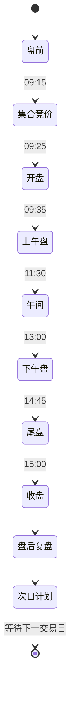

# AI 蜘蛛爬行机器人・交易大脑重构设计（v2）

> 目标：让 AI 蜘蛛成为一名可 
>
> **无人值守**
>
>  的交易员 —— 自己看盘、扫描、研判、下单、看回报，盘后自己复盘、进化、写次日计划。
> 本文以「20 年 AI 操盘手」视角，基于 2026-10-09 真实运行日志（
>
> `Desktop/00.txt`
>
> ）与前后端源码重做需求设计，强调
>
> **可落地、文件级任务、可验收**
>
> 。


***

## 1. 现状诊断（日志实证）

从日志可以确认 6 个**架构级**根因，而非零散 bug：


| #  | 现象（日志原文）                      | 根因                                                                                           |
| -- | ----------------------------- | -------------------------------------------------------------------------------------------- |
| P1 | 大量「🔄 智能切换到【**undefined**】」刷屏 | 巡回清单已扩到全部 38 卡，但引擎 `cardNames` 只映射 10 张、`scanRound` 的 `switch` 只处理 10 张 → 其余卡切过去是 "无名 + 空操作" |
| P2 | 蜘蛛点「— 55 手」「服装家纺萌芽」当个股        | `uiGraph` 在逐笔成交 / 热力图等卡把**非个股元素**误判成 row；点了也没有真正的 "分析" 动作（不跳 K 线、不出研判结论）                     |
| P3 | 「✅ 大盘：」后面是空的                  | 大盘指数采集器没解析出数据；多卡片 "扫了但没数据"                                                                   |
| P4 | 买入理由 "高位运行 + 情绪好"，14600 股满仓单票 | 评分是**单日规则加权**，无多周期趋势、无买点位置、无止损；仓位简单 20% 预算，实盘里几乎满仓追高                                         |
| P5 | 买入后连续「风控拦截：资金不足一手」、重复扫同一只     | 无持仓 / 资金状态闭环，系统陷入 "重复评分→拦截"，没有 "看完→下一张 / 下一步" 的清晰推进                                          |
| P6 | 蜘蛛动作与日志对不上、节奏混乱               | **双调度中枢打架**：引擎 `scanRound` 与蜘蛛 `autoDiscoverNext` 各自驱动切卡，互相覆盖                                |

**一句话结论**：蜘蛛现在是 "会爬、会点" 的动画，但背后没有一个**统一的交易大脑**告诉它 "现在是什么时段、该看哪张卡、看到的数据怎么研判、该不该下单、下完怎么跟踪、盘后怎么复盘"。


***

## 2. 设计目标与原则

**一个目标**：无人值守下，系统自动完成

**看盘 → 扫描 → 研判 → 下单 → 成交回报 → 持仓管理 → 盘后复盘 → 策略进化 → 次日计划** 的完整闭环。

**五条原则**：


1. **单一调度中枢**：只有一个 "交易大脑" 主状态机驱动一切，蜘蛛是它的 "实体化身"，所见即所做；

2. **卡片即能力**：每张卡用 "能力注册表" 声明怎么采集、有哪些可交互元素、能产出什么，**不再硬编码 switch**；

3. **数据真实**：所有点位 / 结论来自真实行情与 DOM，宁可提示 "等待数据"，不造假；

4. **风控优先于收益**：先定止损 / 仓位 / 回撤红线，再谈买点；

5. **闭环可进化**：每笔交易可归因，复盘结论回灌策略参数，次日自动出计划。


***

## 3. 总体架构：五层 + 一条时间主轴


```mermaid
flowchart TB
  subgraph T["🕐 交易日主状态机（单一调度中枢）"]
    direction lr
    T1[盘前] --> T2[集合竞价] --> T3[开盘] --> T4[盘中轮询]
    T4 --> T5[尾盘] --> T6[收盘] --> T7[盘后复盘进化] --> T8[次日计划]
  end

  T --> L1
  subgraph L1["① 感知层 Perception"]
    P1[行情: 指数/个股/板块/逐笔]
    P2[卡片 DOM: collectUi 元素/行/文字]
  end
  L1 --> L2
  subgraph L2["② 卡片能力注册表 Card Registry"]
    C1[38 卡: 采集器/交互元素/分析器/产出]
  end
  L2 --> L3
  subgraph L3["③ 决策层 Decision"]
    D1[多因子+多周期+买点质量打分]
    D2[仓位: 凯利/风险预算]
    D3[风控: 止损止盈/回撤/集中度]
  end
  L3 --> L4
  subgraph L4["④ 执行层 Execution"]
    E1[模拟盘自动下单 / 实盘确认桥]
    E2[成交回报]
  end
  L4 --> L5
  subgraph L5["⑤ 复盘进化层 Review & Evolution"]
    R1[绩效归因] --> R2[策略参数回灌] --> R3[次日作战计划]
  end

  L3 -.驱动.-> SP[🕷 蜘蛛可视化: 爬/扫/点/下单/回报]
  L4 -.驱动.-> SP
```

**关键变化**：蜘蛛不再自己决定去哪，而是由 "交易大脑" 在每个时段下发任务；蜘蛛的每个动作都对应大脑的一个真实步骤。


***

## 4. 卡片能力注册表（替代硬编码 switch）

新增 `src/components/spider/cardRegistry.ts`，为每张卡声明：


```
export interface CardCapability {
  id: CardId;
  title: string;
  group: CardGroup;              // 环境/主线/个股/交易/复盘
  /** 采集卡片内的行/数据（返回结构化记录） */
  collect: () => CardRecord[];
  /** 可交互元素（复用 collectUi，按语义筛选） */
  interactions?: UiSemantic[];
  /** 是否产出交易信号 */
  producesSignal: boolean;
  /** 卡片专属分析器（可选） */
  analyze?: (records: CardRecord[]) => AnalysisResult;
  /** 建议停留时长 ms */
  dwellMs: number;
}
```

### 全 38 卡能力矩阵


| 分组     | 卡片                   | 核心功能               | 可交互                    | 产出信号          |
| ------ | -------------------- | ------------------ | ---------------------- | ------------- |
| **环境** | market 大盘指数          | 指数点位 / 涨跌 / 量能     | 指数切换                   | 大盘风控（降仓 / 暂停） |
|        | radar 涨停雷达           | 涨停个股 / 封单 / 情绪     | 排序                     | 情绪温度          |
|        | limitpool 涨停池明细      | 涨停 / 连板 / 炸板       | tab：天梯 / 梯队 / 涨停       | 打板候选          |
|        | heatmatrix 全市场热力矩阵   | 涨跌分布 / 冰点          | 板块下钻                   | 市场宽度          |
|        | sieve 连板选股器          | 连板梯队 / 空间板         | tab                    | 空间龙头          |
|        | auction 集合竞价         | 竞价涨幅 / 匹配量         | 排序                     | 竞价候选 / 挂单     |
| **主线** | rank 榜单              | 涨幅 / 跌幅 / 换手 / 成交额 | tab 切换、滚动、行点击          | 领涨股           |
|        | watch 自选股            | 关注股实时              | 行点击、加自选                | **核心买卖信号**    |
|        | trades 逐笔成交          | 大单 / 异动            | 滚动                     | 主力动向          |
|        | spider 短线精灵          | 实时异动               | 行点击                    | 异动信号          |
|        | sectorevent 板块异动     | 拉升 / 跳水            | 行点击                    | 板块异动          |
|        | sector 板块行情          | 行业涨跌               | 行点击、滚动                 | 强势行业          |
|        | sectorheat 板块热力图     | 板块热力               | 下钻                     | 热点板块          |
|        | concept 概念题材         | 概念涨跌               | 行点击、滚动                 | 强势概念          |
|        | themelib 题材库         | 题材 / 龙头 / 成分       | tab、行点击                | 题材龙头          |
|        | dragon 龙虎榜复盘         | 游资 / 机构席位          | 行点击、滚动                 | 资金跟随          |
| **个股** | chart K 线图           | K 线 / 指标 / 画线      | 周期 / 指标切换              | 买卖点确认         |
|        | multigrid 多股同列       | 多股对照               | 行点击                    | 横向比较          |
|        | f10 F10 个股资料         | 基本面 / 财务           | tab                    | 基本面过滤         |
|        | screener 条件选股        | 条件筛选               | 查询、滚动                  | 候选池           |
|        | alert 预警管理           | 价格预警               | 增删预警                   | 触发事件          |
|        | news 盘中快讯            | 资讯                 | 滚动                     | 事件驱动          |
|        | calendar 财经日历        | 事件 / 数据            | 日期                     | 事件日历          |
|        | ipo 新股解禁             | 新股 / 解禁            | tab                    | 风险提示          |
| **交易** | trade 模拟交易           | 下单 / 持仓 / 委托       | side / 仓位 / 下单 / 子 tab | 下单执行          |
|        | signalbridge 信号确认桥   | 信号确认               | 确认 / 拒绝                | 人工闸门          |
|        | ai AI 问数             | 数据问答               | 输入                     | 辅助决策          |
| **复盘** | review AI 复盘         | 当日复盘               | 触发                     | 复盘报告          |
|        | reviewtimeline 复盘时间线 | 时间线                | 筛选                     | 事件回顾          |
|        | battleplan 作战计划      | 计划                 | 编辑                     | 次日计划          |
|        | decisionlog 决策日志     | 决策记录               | 滚动                     | 决策审计          |
|        | strategy 策略库         | 策略参数               | 选择 / 编辑                | 策略切换          |
|        | evolution 进化回灌       | 参数进化               | 触发                     | 参数更新          |
|        | performance 绩效分析     | 绩效指标               | 周期                     | 绩效反馈          |
|        | journal 盯盘日记         | 笔记                 | 编辑                     | 主观记录          |
|        | calc 投资计算器           | 计算                 | 输入                     | 辅助            |
|        | export 数据导出          | 导出                 | 按钮                     | 归档            |
|        | spiderbot AI 爬虫机器人   | 控制台                | 开关                     | 总控            |

**收益**：任何卡片进入后，大脑都知道 "怎么采、采什么、能不能出信号"，彻底消除 undefined 与空操作。


***

## 5. 决策层升级（操盘手核心）

### 5.1 多因子 + 多周期打分（0–100）

替代当前 "单日 pct / 换手" 规则：


| 维度                               | 权重 | 数据来源              |
| -------------------------------- | -- | ----------------- |
| **趋势结构**（多周期：日线 / 60 分 / 均线多头排列） | 25 | K 线 + 均线          |
| **买点位置**（回踩支撑 / 放量突破回踩确认 / 低吸企稳） | 20 | K 线形态 + 位置        |
| **量价配合**（放量突破 / 缩量回踩，量比、换手健康区间）  | 15 | 逐笔 + 量比           |
| **资金流向**（主力净流入 / 大单 / 龙虎榜席位）     | 15 | trades + dragon   |
| **题材强度**（板块热度 / 龙头地位 / 题材持续性）    | 15 | themelib + sector |
| **风险扣分**（回撤 / 波动 / 估值 / 临近解禁）    | 10 | f10 + ipo         |

### 5.2 买点纪律（解决 "高位追买"）


* 单日涨幅 **>5% 不追**，等回踩；

* **不追涨停板**（除非启用打板策略且封单 / 封板时间确认）；

* 突破买点：需**放量 + 回踩不破**双确认；

* 低吸买点：需到**支撑位 + 缩量企稳**；

* 大盘走弱 / 跌停潮时，**只卖不买**。

### 5.3 仓位管理（风险预算 + 凯利）


* 单票上限：常规 20%，强信号（评分 ≥80）最高 30%；

* 单行业集中度上限 40%；

* 凯利公式 `f* = (b·p − q)/b`（p = 历史胜率、b = 盈亏比），实际用**半凯利**并与上限取小；

* 总仓位随大盘状态调节：趋势强 70–90%、震荡 40–60%、走弱 0–30%。

### 5.4 风控硬规则（红线，优先级最高）


| 规则        | 参数（可配）                         |
| --------- | ------------------------------ |
| 个股硬止损     | −5%\~−8%，或跌破关键均线               |
| 止盈        | +15%\~+30% 分批 / 移动止盈（回撤 5% 触发） |
| 大盘风控      | 指数跌破关键位 / 跌停潮 → 降仓、停开新仓        |
| 单日最大回撤    | −3% → 当日停止开新仓                  |
| T+1 / 涨跌停 | 买入当日不可卖；涨跌停无法成交自动撤 / 等         |
| 资金校验      | 不足一手不下单（修复当前重复拦截）              |

### 5.5 卖出逻辑

止损 / 止盈触发、趋势破位（跌破均线）、题材退潮（龙头跌停 / 板块跳水）、弱换强（评分显著更低的持仓换成更强候选）。


***

## 6. 无人值守：交易日主状态机

新增 `src/components/spider/tradingDay.ts`，按时间自动切换阶段（非交易时段也能空转等待）：





| 阶段        | 时间          | 自动动作                                   |
| --------- | ----------- | -------------------------------------- |
| **盘前**    | 08:30–09:15 | 系统自检（数据源 / 资金 / 持仓）、读新闻 / 日历、预扫描、生成观察池 |
| **集合竞价**  | 09:15–09:25 | 竞价分析、候选股排序、挂单计划（竞价策略）                  |
| **开盘**    | 09:25–09:35 | 开盘观察，**不急于开仓**，确认方向                    |
| **上午盘**   | 09:30–11:30 | 按 "环境→主线→个股" 巡回扫描 → 打分 → 模拟下单 / 持仓管理   |
| **午间**    | 11:30–13:00 | 复盘上午、更新候选与仓位计划                         |
| **下午盘**   | 13:00–14:45 | 继续巡回、持仓跟踪、预警处理                         |
| **尾盘**    | 14:45–15:00 | 尾盘决策：新开（强势）/ 减仓（弱势）/ 持有                |
| **盘后**    | 15:00 后     | **自动复盘 → 绩效归因 → 策略进化 → 次日作战计划**        |
| **非交易时段** | —           | 等待；可做回测 / 学习，不交易                       |

每个阶段决定 "蜘蛛该去哪几张卡、做什么"，从根上消除双驱动与空转。


***

## 7. 自动复盘 + 进化闭环

复用后端 `review.rs::run_review`，由主状态机在 15:00 后**自动触发**（当前未被调度）：


1. **交易复盘**：当日收益、胜率、盈亏比、最大回撤、仓位利用率；

2. **逐笔归因**：每笔交易的买入理由 vs 结果，分类（追高 / 低吸 / 突破、止损是否及时、卖飞 / 捂亏）；

3. **主线 / 情绪回顾**：当日题材、龙头、涨停 / 炸板、封板率（顺带修 `reviewBuilder` 炸板计数疑似 bug）；

4. **策略进化**：统计各因子近期有效性，回灌打分权重 / 阈值（`evolution.rs`）；

5. **次日计划**：输出候选股、买点、建议仓位、止损位，写入 `battleplan`。


   ```mermaid
   flow LR
     A[当日成交/持仓] --> B[绩效归因]
     B --> C{因子是否有效}
     C -->|有效| D[权重↑]
     C -->|失效| E[权重↓/停用]
     D & E --> F[更新策略参数]
     F --> G[生成次日作战计划]
   ```


***

## 8. 蜘蛛可视化：所见即所做

蜘蛛动作与主状态机步骤一一对应：


| 大脑步骤 | 蜘蛛可视化                            |
| ---- | -------------------------------- |
| 进入卡片 | 三幕切卡（沿边框 / 标题，不飞行，已实现）           |
| 采集数据 | 标题扫描 + 逐行光束 + 数据粒子（修复进度 bug）     |
| 切换维度 | 爬去点 tab，元素按压涟漪，列表真实切换            |
| 深度研判 | 点个股 → 打开 K 线 / F10，头顶气泡显示评分 / 结论 |
| 下单   | 爬去点 side→仓位→下单，按钮按压，真实成交         |
| 成交回报 | 切委托 / 成交，爬到记录，头顶「✅ 已成交 @价 量」     |
| 复盘   | 逐卡回顾，气泡显示归因结论                    |

**修正点**：①`uiGraph` 收紧 row 判定，逐笔 / 热力图等卡只把真实个股行当 row（修复 "55 手 / 萌芽" 误点）；②非个股元素即使可点也不标为 row。


***

## 9. 分阶段落地任务

### P0・止血（先让系统正常，0.5 天）


* [ ] **合并单一调度中枢**：引擎运行时蜘蛛 `autoDiscoverNext` 仅兜底，不再主动轮转（消除双驱动）；

* [ ] **消除 undefined**：`cardNames` 用 `CARD_META.title` 兜底全卡；`scanRound` 对无专属扫描器的卡走**通用浏览采集**（collectUi + 逐行扫），不空操作；

* [ ] 修「大盘：空」等空数据展示（无数据显式提示，不打印空结论）。

### P1・卡片能力注册表（1 天）


* [ ] 新增 `cardRegistry.ts`，38 卡全部注册 collect/interactions/analyze；

* [ ] `tradingDay.ts` 时间状态机接管 "去哪、做什么"；

* [ ] 收紧 row 判定，修复误点非个股元素。

### P2・决策与风控升级（1.5 天）


* [ ] 多因子 + 多周期打分接入 K 线 / 均线 / 资金 / 题材；

* [ ] 买点纪律、凯利 / 风险预算仓位、止损止盈与大盘风控硬规则；

* [ ] 交易闭环由 "信号 + 持仓 + 资金" 状态驱动，修复重复拦截。

### P3・自动复盘与进化（1 天）


* [ ] 15:00 自动触发 `run_review`；

* [ ] 逐笔归因 + 因子回灌（`evolution.rs`）+ 自动生成次日 `battleplan`；

* [ ] 修 `reviewBuilder` 炸板计数；全链路无人值守验收。


***

## 10. 验收标准（无人值守）


1. 启动后**无 undefined / 无空操作**，38 卡按时段正确巡回、采集真实数据；

2. 蜘蛛只点**真实个股 / 按钮**，点个股后能看到 K 线 / 评分结论；

3. 买入符合买点纪律（不追高），仓位符合上限，止损 / 止盈 / 回撤红线生效；

4. 模拟盘自动下单并看到真实成交回报；实盘只发信号、人工确认；

5. 收盘后自动产出：复盘报告 + 绩效归因 + 更新后的策略参数 + 次日作战计划；

6. 连续运行一个完整交易日（含盘前 / 盘中 / 盘后）无需人工干预即完成闭环。


***

## 附录：关键文件清单


| 动作 | 文件                                                              |
| -- | --------------------------------------------------------------- |
| 新增 | `src/components/spider/cardRegistry.ts`                         |
| 新增 | `src/components/spider/tradingDay.ts`                           |
| 改造 | `src/components/spider/ProceduralSpider.vue`（单一中枢驱动）            |
| 改造 | `src/composables/useSpiderBotEngine.ts`（cardNames 兜底、通用采集、去双驱动） |
| 改造 | `src/components/spider/uiGraph.ts`（收紧 row 判定）                   |
| 改造 | `src/ai/scoring.ts` / `src/ai/risk.ts`（多因子、仓位、风控）               |
| 复用 | 后端 `ai/review.rs`、`ai/evolution.rs`、`ai/autoexec.rs`            |

---

## 落地状态（2026-10-09，P0–P3 全部完成）

### 已交付模块

| 阶段 | 关键产物 |
| -- | ------- |
| P0 止血 | 修复龙虎榜等 7 处卡片选择器；selectorCheck 自检 + 右上角红角标；删除引擎 mock 与 300ms 二次覆盖；合并单一调度中枢、消除 undefined、空数据防护；蜘蛛订阅 fastbrain-signal 头顶气泡 |
| P1 路网/时间机 | `graph.ts`（卡片骨架路网 + A*）、`director.ts`（三幕分镜：旧卡边框离场→路网穿行→新卡入场，不再空中飞行）、`sim.ts`（滑行扫描）；`cardRegistry.ts`（38 卡全注册：group / rowKind / dwellMs）、`tradingDay.ts`（九段 TradingPhase、开仓仅盘中、复盘仅盘后）；目标卡不在 DOM 时 bench.open 真实打开 |
| P1 UI 操作 | `uiGraph.ts`（识别 button/tab/link/row/input/scroll + 语义；个股行 6 位代码硬校验、逐笔行只观察）、`actions.ts`（tap 完整事件序列、scrollBy）、`playbook.ts`（按行类型编排）；交易闭环（模拟盘全自动点买卖并看成交回报，实盘只发信号人工确认） |
| P2 决策风控 | `indicators.ts`（MA/EMA/MACD/KDJ/RSI、多头排列、breakout/pullback/low-buy 买点、大盘 regime）、`decision.ts`（六因子加权：趋势25·买点20·量价15·资金15·题材15·风险10；买点纪律：涨幅>8% 不追、大盘 down 只卖不买）、`position.ts`（半凯利 + 单票25%/行业40%/总仓随大盘 0.9/0.6/0.3）、止损止盈硬规则 |
| P3 复盘进化 | 引擎 `maybeAutoReview()` 盘后流水线（复盘→结果标注→`evolve.ts` 参数调权→次日作战计划，同日幂等）；`evolve.ts`（样本<8 不动防过拟合；胜率/期望/误报驱动门槛与凯利缩放，权重归一化、可追溯可回滚）；修复封板率炸板计数、scoring 缺失数据口径 |

### 自动化验证结果

- 单元测试：**67 文件 662 用例全部通过**（`npx vitest run`）。
- 类型检查：**vue-tsc 零错误**。
- 前端构建：**vite build 成功**（仅 chunk 体积提示，无害）。
- 后端：Rust dev 编译通过（`cnc_symbol` 支持 sh/sz/bj 前缀以拉指数 K 线）。

### 待用户肉眼验收（会话隔离，助手无法截图）

1. TickGold 窗口按 `Ctrl+R` 整页刷新（累积 HMR 可能断链）。
2. 盘中：确认蜘蛛沿卡片边框/路网真实切卡（非飞行），目标卡有标题扫描 + 逐行光束 + 右上角角标；扫个股后头顶气泡出 BUY/SELL/HOLD；模拟盘可看到自动点买卖与成交回报。
3. 盘后/休市：日志依次出现「🌆 盘后自动复盘启动 → 📖 复盘 N 篇 → 🧬 结果标注 → 🧠 参数进化（样本…）→ 🗺 次日作战计划」，蜘蛛巡回 review / battleplan / evolution / decisionlog 卡。
4. 角标说明：右上角为「选择器失效告警角标」，仅 dev 环境、某已打开卡 no-row/extract-empty 时变红，正常时不显示，非缺陷。